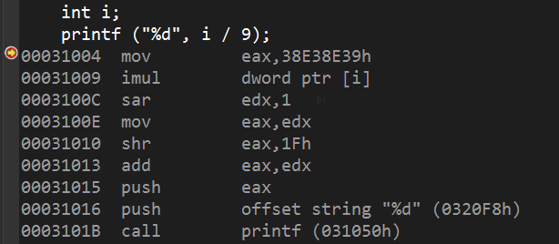

# 汇编语言
## 著名CPU
- **8086**
    8086是Intel公司设计的16位微处理器芯片，是x86架构的鼻祖。
- **80386**
    也称为**i386**。是Intel公司设计的32位微处理器芯片。
---
## 寄存器分类（8086/i386）
- 通用寄存器
    - 四个数据寄存器
        - AX/EAX 累加器。加法乘法指令的缺省寄存器
        - BX/EBX 基地址寄存器。作为存储器指针使用
        - CX/ECX 计数器。在循环和字符串操作时控制次数；在位操作时CL指明移位的位数
        - DX/EDX 数据寄存器。乘除运算中常作为默认参与数参与运算；存放I/O端口地址
    - 两个变址寄存器
        - SI/ESI 源变址寄存器
        - DI/EDI 目的变址寄存器
    - 两个指针寄存器
        - SP/ESP 堆栈指针寄存器 栈顶指针
        - BP/EBP 基指针寄存器 栈底指针
- 控制寄存器
    - IP/EIP 指令指针寄存器 存放下一个CPU指令的内存地址
    - EFL/FLAG 标志寄存器 存放前一个指令执行结果的信息
- 四个段寄存器
    - CS 代码段寄存器
    - DS 数据段寄存器
    - SS 堆栈段寄存器
    - ES 附加段寄存器

## 通用寄存器
这些寄存器除了在特殊情况下有专用的作用外，其他时候都可以用来传送和暂存数据，因此叫通用寄存器
### 数据寄存器(Data Registers)

> E表示extend，L表示Low，H表示High，注意只有数据寄存器才能分HL
#### AX(Accumulator Registers)的特殊作用
- DIV除法指令
    - 当除数为8位时，那么被除数为16位（[为啥](https://www.cnblogs.com/mrblug/p/5721196.html)），保存在AX中，结果中AL存储商，AH存储余数。
    - 当除数为16位时，那么被除数为32位，AX存放被除数的低16位，DX存放被除数的高16位，结果中AX存储商，DX存储余数。
- MUL乘法指令
    - 两个乘数都是8位，那么AL会默认存放一个（另一个存在其他寄存器或者内存中），结果存放在AX
    - 两个乘数都是16位，那么AX会默认存放一个，结果的高位存在DX，低位存在AX。
#### BX(Base Register)的特殊作用
在寻址的情况下，一般用来存放偏移地址
#### CX(Count Register)的特殊作用
在使用LOOP指令时，使用CX跳出循环。CX不等于0的时候，CX = CX - 1，否则跳出
#### DX(Data Register)的特殊作用
详看AX

### 索引寄存器(Index Registers)

> 与BX寄存器功能相近，但是不能拆分成两个8位寄存器使用

两者都是在某个地址的基础上进行偏移变化，因此都需要基址寄存器：
- 一般与DS数据段寄存器使用
- 在串处理指令中，SI与DS联用，DI与ES联用

### 指针寄存器(Pointer Registers)

> IP(Instruction Pointer)
#### BP(Base Pointer)的特殊作用
如果寻址操作的偏移地址为BP且段地址不给出，则段地址默认为SS
```
MOV AX, [BP]        ; equal MOV AX, SS:[BP]
MOV AX, CS:[BP]
```
#### SP(Stack Pointer)的特殊作用
`SS:[SP]`永远指向栈顶
## 控制寄存器(Control Registers)
IP与FL(Flag Registers)相结合被认为是控制寄存器
FL上的标志位通常有:
- Overflow Flag(OF)：标志带符号算术运算后是否高位溢出
- Direction Flag(DF)：标志比较字符串的方向，0表示左->右，1表示右->左
- Interrupt Flag(IF)：标志是否收到外中断
- Trap Flag(TF)：标志软中断，在debug模式下为1
- Sign Flag(SF)：表示运算后的符号，0为正，1为负
- Zero Flag(ZF)：表示比较或者算法的返回值，非0为1
- Auxiliary Carry Flag(AF)：标志单位计算的进位
- Parity Flag(PF)：表示奇偶校验结果
- Carry Flag(CF)：标志算术运算后的进位

Flag|||||O|D|I|T|S|Z||A||P||C|
-|-|-|-|-|-|-|-|-|-|-|-|-|-|-|-|-
Bit no|15|14|13|12|11|10|9|8|7|6|5|4|3|2|1|0|

## 段
### 分段的原因
在**8086**CPU中，地址总线有20根，也就是说每次能传输20位的地址，寻址能力有2^20=1Mb。但是CPU的寄存器只有16位，并不能一次处理20位的地址。因此**8086**在内部通过两个16位的地址合成一个20位的地址

> 基地址 = 段地址 << 4
物理地址 = 基地址 + 偏移地址
### 段的类型
- **数据段** 存放数据的内存
- **代码段** 存放代码（指令）的内存
- **栈段** 具有栈结构的内存
### 段寄存器
#### CS与IP
CS是代码段寄存器，通常结合IP进行指令的读取。指令的地址在`CS:[IP]`
#### SS与SP与BP
SS是堆栈段寄存器，8086CPU不检查对栈的越界操作

---
## 汇编程序
一个汇编程序可以分为
- **数据段(data section)**
    数据段用于声明初始化的变量或者常量，其内容不会在运行的时候改变。声明的语句为：
    ```section .data```
- **bss段(bss section)**
    bss段用于声明变量。声明语法为：
    `section .bss`
- **代码段(text section)**
    代码段用于保存实际的代码。必须以`global _start`告诉内核程序的执行位置。
    ```
    section .text
        global _start
    _start:
    ```
- **注释**
    以`;`开头

汇编语句由有三种类型
- 可执行指令
- 汇编程序指令或者伪操作
- 宏

汇编语句语法
> [label] mnemonic [operands] [;comment]
[标签] 指令 [操作数] [注释]

## Hello world
```
section	.text
	global _start       ;must be declared for using gcc
_start:                     ;tell linker entry point
	mov	edx, len    ;message length
	mov	ecx, msg    ;message to write
	mov	ebx, 1	    ;file descriptor (stdout)
	mov	eax, 4	    ;system call number (sys_write)
	int	0x80        ;call kernel
	mov	eax, 1	    ;system call number (sys_exit)
	int	0x80        ;call kernel

section	.data

msg	db	'Hello, world!',0xa	;our dear string
len	equ	$ - msg			;length of our dear string
```

## 系统调用
系统调用是从用户态切换到内核态的一组API。调用步骤如下：
1. 将系统调用码放入EAX
2. 将参数依次存入EBX,ECX,EDX,ESI,EDI,EBP寄存器
3. 启动中断`int 0x80`(linux)
4. 返回值存储在EAX

系统调用码在 */usr/include/asm/unistd.h*中列出，下表列举出一些系统调用
|EAX|NAME|EBX|ECX|EDX|ESX|EDI|
-|-|-|-|-|-|-|
1|SYS_EXIT|int|
2|SYS_FORK|struct pt_regs|
3|SYS_READ|uint|char*|size_t|
4|SYS_WRITE|uint|const char*|size_t|
5|SYS_OPEN|const char*|int|int|
6|SYS_CLOSE|uint|
## 寻址方法
- **寄存器寻址(Register Addressing)**
    操作数已经在寄存器里面。源和目的数都可以是寄存器。
    ```
    mov dx, second_parm
    mov first_parm, cx
    mov eax, ebx
    ```
- **立即寻址(Immediate Addressing)**
    立即数可以为8位或者16位。源可以为寄存器或者储存器位置，目的数为立即数。速度最快。
    ```
    byte_val db 150 ;定义byte类型变量
    add byte_val, 65
    add ax, 45h
    ```

## 常用指令
### int
>int 0x80

常用指令为`int 0x80`，表示中断进行系统调用
### call
>call _printf

函数调用
###  cdq
> cdq

将eax的第31位复制到edx的每一位上。常出现在除法中，实际上是有符号数位数的扩展
### neg
> neg eax

求补运算，在数学上相当于取负
### setne
> setne al

set not equal，ZF==1时al=0，否则al=1
### sbb
> sbb eax, ebx

带借位减法指令。上面等价于`eax = eax - ebx - CF`
eax = 1020H, ebx = 1200H, CF = 1, => sbb eax, ebx = FE1F
### shl
> shl eax, 3

位运算左移。Shift Logical Left。
### sar shr
> sar eax, 3

位运算右移。sar是有符号移位，shr是无符号移位
### mul
> mul dword ptr [i]

将eax的值与变量i相乘，结果的低32位放到eax，高32位放到edx

### rep
> rep opr

重复执行后面的指令。ecx每执行一次-1。
### stos
> mov ecx, 30
mov eax, 0cccccccch
rep stos dword ptr es:[edi]

串存储指令。将al/ax/eax的值存储到es:edi指定的内存单元
### scasb/scasw/scasd
> push esi
mov esi, [esp+4+arg_0]
push edi
mov edi, esi
or ecx, 0ffffffffh
xor eax, eax
repne scasb

在字符串或者数组中寻找一个值。分别将al/ax/eax中的值与edi寻址的一个byte/word/dword进行比较。常常结合repne使用。若查找成功，则edi指向匹配字符后面的位置。示例含义是内联strlen
### test
> test eax, 100b
jnz loc_40000
### test
> test eax, eax

test执行AND运算，并设置zf标记。test与and命令的区别是，and命令会将结果返回到eax。实例含义是常见的判断寄存器是否为空。

---
# 算数运算
算数运算要与赋值语句结合才会生成代码
```c++
5 + 6;  // 无效语句
int i = 5 + 6; // OK
```
---
## 加法
### 常量 + 常量
```c++
int i = 5 + 6;

mov dword ptr [ebp-4], 11
```
编译器不会生成5+6的指令，而是在编译期间就算出5+6的值11，并将其赋值给i
### 变量 + 常量
```c++
i = i + 1;

mov eax, dword ptr [ebp-4]
add eax, 1
mov dword ptr[ebp-4], eax
```
编译器使用add指令完成加法
### 变量 + 变量
```c++
i = i + j;

mov eax, dword ptr[ebp-4]
add eax, dword ptr[ebp-8]
mov dword ptr[ebp-4], eax
```
也是使用add指令完成加法

---
## 减法
减法与加法类似，只不过指令是sub。但是有时候计算机会使用加法补码来完成减法。
> x - 2
 = x + (-2)
 = x + 2(补)

---
 ## 乘法
 乘法指令有有符号乘法imul以及无符号乘法mul两种。规则也与上面类似，下面说一下特例
 ### 乘数是2的幂
 使用左移代替乘法指令
 ```c++
 i = i * 16;

 mov eax, dword ptr [ebp-4]
 shl eax, 4     // 左移4位
 ```
 Debug版以及Release版都会转换
 ### 组合运算
当组合运算中的乘数为2、4、8时，组合运算会用lea指令替代
 ```c++
 i = i * 4 + 5;

 mov ecx, dword ptr [ebp-4]
 lea edx, [ecx*4+5]
 mov dword ptr [ebp-4], edx
 ```
 lea指令是取址指令，周期要比mul短
 而乘数非2、4、8时，会按照正常流程执行
 ### 乘数非2的幂
 ```c++
 i = i * 15;

 // Debug
 mov edx, dword ptr [ebp-4]
 imul edx, edx, 0Fh
 mov dword ptr [ebp-4], edx

// Release
 push esi
 mov esi, dword ptr [ebp-4]
 lea eax, [esi+esi*2]
 lea eax, [eax+eax*4]
 mov dword ptr[ebp-4], eax
 ```
 Debug版注重调试，直接使用乘法指令替代
 Release版本会将乘数分解因子，尽量使用低周期指令代替（强度削弱）。例如上例是这样分解的
 > i * 15
 = (i * 3) * 5
 = (i + i * 2) * 5
 = eax * 5
 = eax + eax * 4
 ---
 ## 整数除法
在C语言中，整数除法有三种情况
- 两个无符号整数整除，结果是无符号的
- 两个有符号整数整除，结果是有符号的
- **有符号整数与无符号整数混除，结果是无符号的**，有符号的符号位会被当成数据位看待

除法指令有有符号除法idiv以及无符号除法div两种，下面看看特殊情况
### 除数是2的幂
```c++
i = i / 2;

mov eax, dword ptr [ebp-4]
cdq
sub eax, edx
sar eax, 1
```
除以2的幂可以通过右移来实现。
在除法中，除数需要放到指定的寄存器eax中。cdq命令将eax的最高位复制到edx中，实际上就是位数扩展。下面是一个很奇怪的减法: eax = eax - edx。实际上这里巧妙地实现了一个分支结构。
我们知道:
> 3 / 2 = 1
-3 / 2 = -1

除法是向0取整的
但是当我们使用右移代替除法时
> 3 >> 1 = 1
> -3 >> 1 = -2
11111101 >> 1 = 11111110

由于右移丢失最后位，因此右移实际上是向下取整的！当除数为正数时，向下取整没问题；但除数为负数时，我们需要对其+1再右移，就能避免位数丢失造成的取整异常（这里有数学证明）。
所以现在的逻辑是
```
if(eax < 0) eax += 1;
else eax = eax
```
再回顾上面的cdq指令，当eax为负数时，edx是11111111(-1)；当eax为正数时，edx是00000000(0)。使用eax-edx，恰好就能实现上面的分支结构！
最后右移幂位数完成除法。
### 除数非2的幂

这里编译器进行了一次强度削弱，使用乘法指令以及移位指令代替除法指令。具体方法如下
设x是变量，o是常量，则
$$\frac{x}{o} = x \ast \frac{1}{o} = x \ast \frac{2^n}{2^n \ast o} = x \ast \frac{2^n}{o} \ast \frac{1}{2^n}$$
由于$o$在编译期间已知，$n$是编译器选择的，因此$\frac{2^n}{o}$可以在编译期间算出，这个数也被称为Megic Number（魔数、幻数），例子中是0x38E38E39。
我们可以通过移位的个数以及魔数还原出被除数o。
至于上面的shr以及add指令，实际上也是做了一个分支结构，当eax是负数的时候，右移31位的出来的值是1，否则是0，它等价于
```
if (eax < 0) eax += 1
else eax = eax
```
也是避免位移造成的取整异常
#### 变体
- Magic Number超出4字节整数的表示范围
- 除数为负数
- Magic Number > 0x7FFFFFFF，当除数是正数
- Magic Number < 0x80000000，当除数是负数
---

# 逻辑运算与关系运算
## 三元运算符
> 表达式1 ? 表达式2 : 表达式3

- 1为常量，则在编译器得出结果，不会存在指令
- 2或3是变量，则不会优化
- 2和3是常量，优化
    - 1是简单比较，2和3的差值等于1
    - 1是简单比较，2和3的差值大于1
    - 1是复杂比较，2和3的差值大于1
### 1是简单比较，2和3的差值等于1
```c++
return argc == 5 ? 5 : 6;

xor eax,eax;
cmp dword ptr [argc], 5
setne al
add eax, 5
```
使用cmp以及setne实现比较以及+1
### 1是简单比较，2和3的差值大于1
```c++
return argc == 5 ? 4 : 10;

mov eax, dword ptr [argc]
sub eax, 5
neg eax         ; 求补，设置CF，仅当eax=0时，CF=0
sbb eax, eax    ; 借位减法，使用CF
and eax, 6
add eax, 4
```
等价于`reg == A ? C : B+C`
使用sub以及neg实现比较，使用add实现赋值（表达式2） 然后利用sub结果配合and实现赋值（表达式3），当表达式3小于表达式2时，add的值是负数
### 1是复杂比较，2和3的差值大于1
区间比较属于复杂比较
```
return argc <= 8 ? 4 : 10

xor eax, eax
cmp dword ptr [argc], 8
setg al     ; set greater
dec eax
and al, 0FAH
add eax, 0AH
```
综合两种优化方案
使用cmp实现比较，add实现赋值，and实现另一种情况的赋值

---
# 循环
## Debug版
### do循环
```
DO_BEGIN:
...             ; 循环的语句块
; 影响标记位的指令
jxx DO_BEGIN
```
### while循环
```
WHILE_BEGIN:
; 影响标记位的指令
jxx WHILE_END
...
jmp WHILE_BEGIN
WHILE_END
```
while比do多用了一条跳转指令，因此效率比do低
### for循环
```
mov mem/reg, xxx    ; 初值
jmp FOR_CMP
FOR_STEP:
mov reg, Step
add reg, 1          ; Step+1
mov Step, eax
FOR_CMP:
mov ecx, Step
cmp ecx, StepEnd    ; Step < Step End
jxx FOR_END
...                 ; 代码块
jmp FOR_STEP
FOR_END
```
最难读懂
从结构特征可以看出，从效率上来说 do > while > for
## Release 优化
### while循环
while循环与do循环的区别就在于是否先判断条件，因此while循环等价于
```
if (XXX){
    do{

    } while (XXX);
}
```
Release版本下，编译器就是这样将while循环结构改成单分支结构加上do循环结构
### for循环
for的循环结构与while的循环结构相似，实际上将赋初值外提，对变量的操作放到循环体内，完全完全可以等价于while循环
```
for (int i = 0; i < 5; i++){
    ...
}

可以等价于

int i = 0;
while(i < 5){
    ...
    i++;
}
```
既然for循环能转换为while循环，while循环能转换为do循环，因此for循环最后也会转换成do循环。事实上也正是如此，所以在逆向过程中，一般都很难还原成for类型的循环，只能尽量等价

---
# 与设备无关的优化方案
## 中间代码生成阶段优化方案
### 常量折叠
```
x = 1 + 2;
```
没必要生成加法指令，直接`x = 3`
### 常量传播
```
x = i * 2;
y = j * 2;
if (x < y){     // 其后没有引用到x跟y
    ...
}
```
对xy的比较可以等价于对ij的比较，直接`if (i < j)`
### 公共表达式
```
x = i * 2;
y = i * 2;
```
`i * 2`是公共表达式，直接`y = x`
### 复写传播
```
x = a;
...     // 没有修改x
y = x + c;
```
没有修改x，直接`y = a + c`
### 剪去不可达分支
```
if (1 > 2){
    ...
}
```
不可达，直接删除if代码块
### 顺序语句代替分支
例如除法中的条件表达式优化
### 强度削弱
例如加法或者移位代替乘法，乘法移位代替除法
### 数学变换
```
x = a * y + b * y;
```
等价于`x = (a + b) * y`，缩减成1次加法1次乘法
### 代码外提
```
while (x < y / 2) {
    ...     // 没有修改y
}
```
不必每次判断都做一次除法，等价于
```
t = y / 2;
while (x < t) {
    ...
}
```
## 目标代码生成阶段优化方案
### 流水线优化
支持流水线的处理器并不会顺序执行指令。在保证计算结果正确的前提下，流水线A在处理第一条指令时，若第二条指令无关，则流水线B会提前处理第二条指令，以提高寄存器的使用率
### 分支优化规则
引入流水线工作机制后，处理器增加一个**分支目标缓冲器**。遇到分支结构，利用**分支目标缓冲器**预测并读取指令目标地址，并进行表格化管理，一次可以记录多个跳转地址。当发生跳转时，查表，找到有则表示并行成功
### 高速缓存
几层Cache