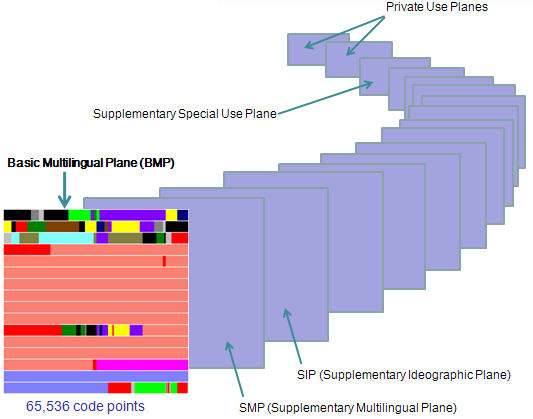

# 字符串编码研究
我们知道，计算机世界里都由0和1组成。我们之所以能看到文字，理解他的意思，是因为我们人为约束了特定的字节序列所表示的意思。这种约束也能称为**编码/解码**。  

## 关键术语介绍  
- 位（Bit）  
比特位，只能为0和1
- 字节（Byte）  
8位
- 字（Word）  
虽然字节是大多数现代计算机的最小存储单元和传输单元，但并不代表它是计算机可以最高效地处理的数据单位。所以**字**代表的是计算机一次作为整体处理的一串比特位，而**字长**表示这一串比特位的长度。一般来说32位电脑的字长是32位也就是4字节
- 字符集（Character Set）  
字符的集合，是一个自然语言文字系统支持的所有抽象字符的集合。例如ASCII字符集，定义了128个字符。
- 字符编码（Character Encoding）  
把字符集中的字符按一定格式编码为某指定集合中某一对象的过程，亦即在字符集与指定集合两者之间建立一个映射关系的过程。  
- 字符编码模型（Character Encoding Model）  
由于历史的原因，早期一般认为字符集和字符编码是同义词，并不需要进行严格区分。因此在像ASCII这样的简单字符集为代表的传统字符编码模型中，这两个概念的含义几乎是等同的。但是，由统一码(Unicode)和通用字符集(UCS)为代表的现代字符编码模型则没有直接采用ASCII这样的简单字符集的编码思路，而是采用了一个全新的编码思路。这个思路化作模型，就是字符编码模型。  
- 码点（Code Point）  
字符编号。  
- 码元（Code Unit）  
字符编码方式CEF(Character Encoding Form)对码点值进行编码处理时作为一个整体来看待的最小基本单元。

## 字符编码模型
  
### 第一层 抽象字符表ACR（Abstract Character Repertoire）  
明确字符的范围。字符表可以是封闭的，即除非创建一个新的标准，否则不允许添加新的字符，比如ASCII字符表和ISO/IEC 8859系列都是这样的例子；字符表也可以是开放的，即允许不断添加新的字符，比如Unicode字符表是这方面的例子。  
### 第二层 编号字符集CCS（Coded Character Set）  
前面讲了，抽象字符表里的字符是没有编排顺序的，但无序的抽象字符表只能判断某个字符是否属于某个字符表，却无法方便地引用、指称该字符表中的某个特定字符。为了更方便地引用、指称字符表中的字符，就必须为抽象字符表中的每个字符进行编号。这个编号，称为**码点值**  
### 第三层 字符编码方式CEF（Character Encoding Form）  
将编号字符集里字符的**码点值**编码成有限比特长度的**编码值**。在ASCII这样传统的、简单的字符编码系统中，字符编号就是字符编码，字符编号与字符编码之间是一个直接映射关系。而在Unicode这样现代的、复杂的字符编码系统中，字符编号不一定等于字符编码，字符编号与字符编码之间不一定是一个直接映射关系，比如UTF-8、UTF-16为间接映射，而UTF-32则为直接映射。
### 第四层 字符编码模式CES（Character Encoding Scheme）  
也称作”序列化格式”(Serialization Format)，指的是将字符编号进行编码之后的码元序列映射为字节序列，以便编码后的字符在计算机中进行处理、存储和传输。这一层与平台相关，需要处理的问题有大小端等
### 第五层 传输编码语法TES（Ttransfer Encoding Syntax）  
在某些特殊的传输环境中，需要对上一层次所提供的字节序列作进一步的适应性编码处理。例如Email协议设计为仅能传输7位的ASCII字符。  

## 历史发展
### EBCDIC  
EBCDIC(Extended Binary Coded Decimal Interchange Code)是由国际商用机器公司(IBM)为大型机操作系统而开发设计的，于1964年推出。是最早的编码。缺点是英文不连续  
### ASCII  
ASCII码(American Standard Code for Information Interchange美国信息交换标准码)，由美国国家标准学会ANSI(American National Standard Institute)于1968年正式制定。它虽然不是最早出现的编码，却是最广泛使用的编码。
### ASCII扩展
由于ASCII字符集十分有限，各国都对其进行扩展
- EASCII（Extend ASCII） 欧洲的扩展  
- 汉字的扩展  
    - GB2312 由中国国家标准总局于1980年发布  
    - GB13000  
    - GBK 收录6763个汉字，覆盖了中国大陆99.75%的使用频率，但不支持古汉语及繁体字  
    - GB18030 在GBK基础上增加了CJK中日韩统一表意文字扩充A的汉字  
    - Big5 繁体汉字编码方案，港澳台地区使用  

      

### Unicode  
最后，Unicode一统天下。由多语言软件制造商组成了统一码联盟(The Unicode Consortium)，然后于1991年发布了The Unicode Standard(统一码标准)，定义了一个全球统一的通用字符集，习惯简称为Unicode字符集。注意，这是一个编号字符集，尚未经过字符编码方式CEF和字符编码模式CES进行编码）。它是一个开放的字符集，是可以不断增加字符，理论上支持的字符数量是没有上限  

### UCS
ISO及IEC于1993年联合发布了称之为Universal Multiple-Octet Coded Character Set、简称为UCS、标准号为ISO/IEC 10646-1的全球统一的通用字符集。后来，统一码联盟与ISO/IEC双方都意识到世界上没有必要存在两套全球统一的通用字符集，于是进行整合，并为创立一个单一的全球统一的通用字符集而协同工作。到Unicode 2.0时，Unicode字符集和UCS字符集(ISO/IEC 10646-1)基本保持了一致。  

## Unicode编码
再次提醒，**Unicode指的是字符集**。根据字符编码方式可以将Unicode细分为UTF-8、UTF-16等。  
目前Unicode标准中，将字符按照一定的类别划分到0~16这17个平面中，每个平面中拥有2^16 = 65536个码点。因此，目前Unicode字符集所拥有的码点总数，也就是Unicode的编号空间为17*65536=1114112。  
  
这些平面主要分为下面几个区：
- BMP  
Basic Multilingual Plane基本多语言平面。日常使用的Unicode字符都位于这个平面上  
- SIP  
Supplementary Ideographic Plane增补平面。表示一些特殊的字符（如象形文字），或留作扩展之用
- Private Use Zone  
0xE000~0xF8FF，共6400个码点，被保留为专用，因而永远不会被分配给任何字符
- Surrogate Zone  
0xD800-0xDFFF，目的是用基本平面BMP中的两个码点“代理”表示BMP以外的其他增补平面的字符  
### UTF-32
UTF-32是固定长度的编码，始终占用4个字节，足以容纳所有的 Unicode 字符，所以直接存储Unicode编号即可，不需要任何编码转换。浪费了空间，提高了效率。  
### UTF-16
UTF-16是可变长度的编码，使用2个或者4个字节来存储。  
对于 Unicode 编号范围在 0 ~ FFFF 之间的字符，UTF-16 使用两个字节存储，并且直接存储 Unicode 编号，不用进行编码转换，这跟 UTF-32 非常类似。  
对于 Unicode 编号范围在 10000~10FFFF 之间的字符，UTF-16 使用四个字节存储。  

|Unicode 编号范围（十六进制）|具体的 Unicode 编号（二进制）|UTF-16 编码|编码后的字节数|
|---------|---|---|---|
|0000 0000 ~ 0000 FFFF|  xxxxxxxx xxxxxxxx | xxxxxxxx xxxxxxxx  | 2  |
|0001 0000 ~ 0010 FFFF| yyyy yyyy yyxx xxxx xxxx  | 110110yy yyyyyyyy 110111xx xxxxxxxx  |  4 |
 
### UTF-8
UTF-8是变长编码，使用最少1个字节，最多无限个字节来存储。目前最长使用了4个字节  
从首字节就能判断UTF-8编码有几个字节：
- 首字节以0开头，是单字节编码  
- 首字节以110开头，是双字节编码  
- 首字节以1110开头，是三字节编码，以此类推  
- 其他字节以10开头，是多字节编码中的某个字节  


### BOM（Byte-Order Mark）
我们可以看到，UTF-16与UTF-32都属于多字节的编码。因此在不同的平台里面，根据平台大小端的不同，也会延伸出编码字节序的问题。因此在Unicode中，使用字节顺序标记（BOM）来解决这个问题。  

**它选用了码点值为FEFF的字符来进行标记：**  
- 当这个字符出现在字节流的开头时，则用来标识字节序
- 当这个字符出现在字节流的中间时，则表示字符的原意：*零宽度不中断空格*（ZERO WIDTH NO-BREAK SPACE）  

不同编码的字节序列中所使用的字节序标记BOM本身的字节序列呈现：
  

另外，UTF-8编码本身没有字节序的问题，但仍然有可能会用到BOM——有时被用来标示某文本是UTF-8编码格式的文本。所以说，**在UFT-8编码格式的文本中，如果添加了BOM，则只用它来标示该文本是由UTF-8编码方式编码的，而不用来说明字节序，因为UTF-8编码不存在字节序问题。**  

关于UTF-16BE、UTF-16LE、UTF-32BE和UTF-32LE，这些字符编码已经在IANA注册，不可使用BOM，因为其名称本身已经决定其字节顺序。而UTF-16和UTF-32编码，必须在文本开头使用BOM。

## Windows中的字符编码  
### 代码页（Code Page）
代码页主要用于字符在计算机中的存储和显示，比如，计算机读取了一个二进制字节，那这个字节到底代表哪个字符，就需要到指定的代码页中查找，这个查找的过程就被称为查表。  


### OEM
OEM（Original Equipment Manufacturer原始设备制造商）。在早期没有图形操作系统的时代，操作系统依靠主板BIOS提供的VGA功能来显示字符，因此字符的编码也只能依靠BIOS的编码。而这BIOS代码页被称为OEM代码页。现代的图形操作系统解决了此问题，可以自行渲染各种字符。

### ANSI编码
ANSI的字面意思并非字符编码，而是美国的一个非营利组织——美国国家标准学会(American National Standards Institute)的缩写。ANSI这个组织做了很多标准制定工作，包括C语言规范ANSI C，还有各国字符编码对应的代码页标准  

Windows XP的“区域和语言选项”高级页面的“代码页转换表”中可看到各个语种的代码页
> ·874 (ANSI/OEM -泰文)  
·932 (ANSI/OEM -日文Shift-JIS)  
·936 (ANSI/OEM -简体中文GBK)  
·949 (ANSI/OEM -韩文)  

### Unicode编码
在Unicode标准出现之后，微软从Windows NT开始，趁机把操作系统改了一遍，把所有的核心代码都改成了采用Unicode标准的版本。使用的字符编码方式是UTF-16。  
Windows API中对ANSI编码以及Unicode编码的兼容
```c++
#ifdef UNICODE
#define GetFileVersionInfo  GetFileVersionInfoW
#else
#define GetFileVersionInfo  GetFileVersionInfoA
#endif // !UNICODE
```  
### ANSI编码与Unicode编码的转换
```c++
int
WINAPI
MultiByteToWideChar(
    _In_ UINT CodePage,
    _In_ DWORD dwFlags,
    _In_NLS_string_(cbMultiByte) LPCCH lpMultiByteStr,
    _In_ int cbMultiByte,
    _Out_writes_to_opt_(cchWideChar,return) LPWSTR lpWideCharStr,
    _In_ int cchWideChar
    );


WINBASEAPI
_Success_(return != 0)
         _When_((cchWideChar == -1) && (cbMultiByte != 0), _Post_equal_to_(_String_length_(lpMultiByteStr)+1))
int
WINAPI
WideCharToMultiByte(
    _In_ UINT CodePage,
    _In_ DWORD dwFlags,
    _In_NLS_string_(cchWideChar) LPCWCH lpWideCharStr,
    _In_ int cchWideChar,
    _Out_writes_bytes_to_opt_(cbMultiByte,return) LPSTR lpMultiByteStr,
    _In_ int cbMultiByte,
    _In_opt_ LPCCH lpDefaultChar,
    _Out_opt_ LPBOOL lpUsedDefaultChar
    );

```
窄字符除了可以是ANSI编码以外，还可以是以下编码
```c++
//
//  Code Page Default Values.
//  Please Use Unicode, either UTF-16 (as in WCHAR) or UTF-8 (code page CP_ACP)
//
#define CP_ACP                    0           // default to ANSI code page
#define CP_OEMCP                  1           // default to OEM  code page
#define CP_MACCP                  2           // default to MAC  code page
#define CP_THREAD_ACP             3           // current thread's ANSI code page
#define CP_SYMBOL                 42          // SYMBOL translations

#define CP_UTF7                   65000       // UTF-7 translation
#define CP_UTF8                   65001       // UTF-8 translation
```

## Linux下的字符编码
### 地区与编码
通过`locale`命令来查看当前程序运行的语言环境  
  
可以通过修改`\etc\locale.gen`文件切换locale  

## 宽窄字符的表示
在C++98中，为了支持Unicode字符，使用`wchar_t`类型表示宽字符。但并没有严格规定位宽，而是让`wchar_t`的宽度由编译器实现。因此不同的编译器有着不同的实现方式：
- GNU C++ 规定`wchar_t`为32位  
- Visual C++规定`wchar_t`为16位  

因此对应的字符串在不同平台下面也会有不同的长度
```c++
std::string                 // 都为1字节，窄字符
std::wstring                // Windows下2字节，Unix下4字节
```

后续考虑到平台移植性，C++11统一了存储类型：
- `char16_t`用于存储UTF16
- `char32_t`用于存储UTF32

## C语言下的字符编码
### 设置地区
使用`setlocale`设置当前当前程序运行的语言环境  
```c
setlocale(LC_COLLATE, "zh_CN");
```
### 宽窄字符的转换
使用`mbstowcs`进行窄字符到宽字符之间的转换；使用`wcstombs`进行宽字符到窄字符之间的转换
```c
__DEFINE_CPP_OVERLOAD_STANDARD_NFUNC_0_2_SIZE(
    _ACRTIMP, mbstowcs,
    _Out_writes_opt_z_(_MaxCount), wchar_t,     _Dest,
    _In_z_                         char const*, _Source,
    _In_                           size_t,      _MaxCount
    )

__DEFINE_CPP_OVERLOAD_STANDARD_NFUNC_0_2_SIZE(
    _ACRTIMP, wcstombs,
    _Out_writes_opt_(_MaxCount),   char,           _Dest,
    _In_z_                         wchar_t const*, _Source,
    _In_                           size_t,         _MaxCount
    )
```
窄字符编码由地区设定，宽字符编码由编译器决定  

## C++下的字符编码
### 设置地区
使用`std::locale`类表示某个地区；使用`std::locale::global`函数设置地区
```c++
std::locale::global(std::locale(""));            // 使用系统区域化设置
std::locale::global(std::locale("zh_CN.gbk"))    // 中文gbk编码
std::locale::global(std::locale("zh_CN.utf8"))   // 中文utf8编码
```
### 宽窄字符的转换
在标准库中，宽窄字符的转换使用`std::wstring_convert`实现
```c++

```


```c++
// Windows
CHAR* ansi_str = "这是ANSI编码";
WCHAR* u16_str = L"这是UTF-16编码";

// Linux
char* u8_str = u8"这是UTF-8编码";
char16_t* u16_str = u"这是UTF-16编码";
char32_t* u32_str = U"这是UTF-32编码";
```

## 参考
[刨根问底字符串](https://www.cnblogs.com/benbenalin/category/1005679.html)