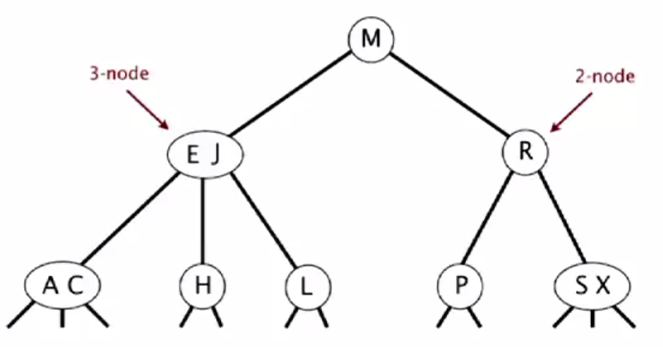
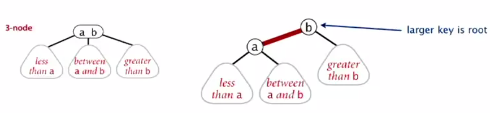
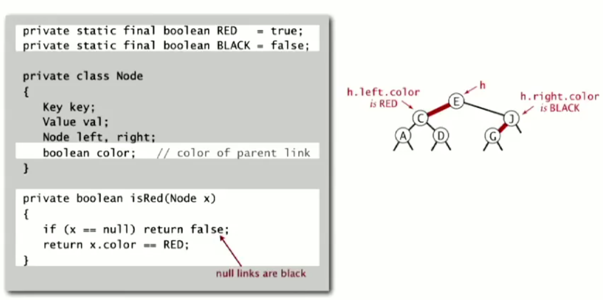
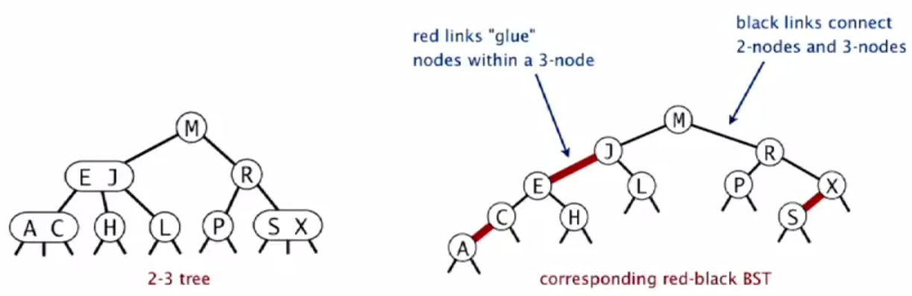
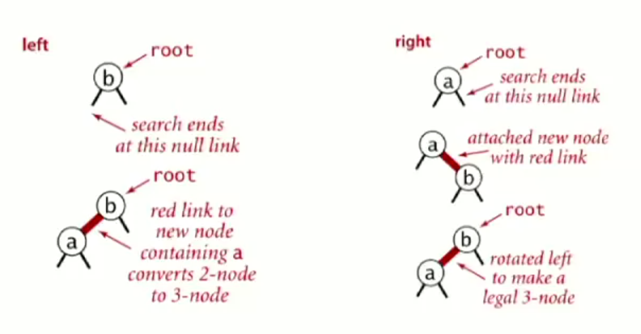
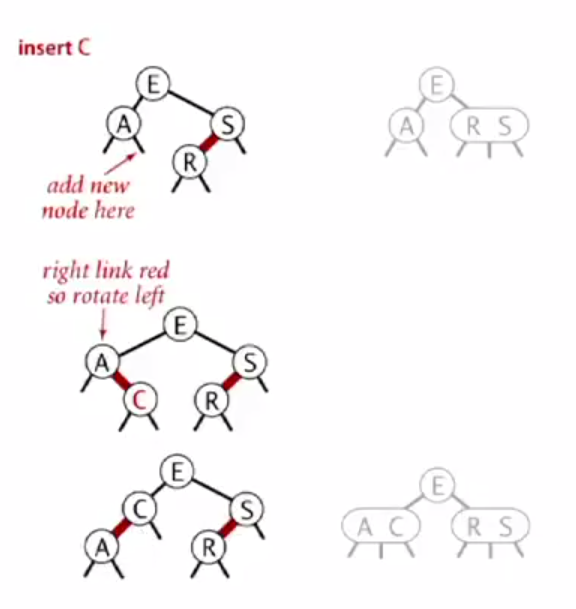
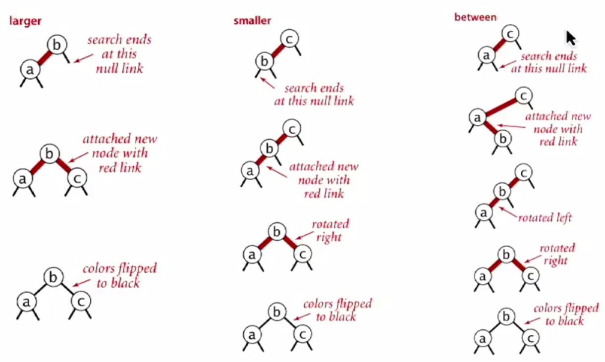
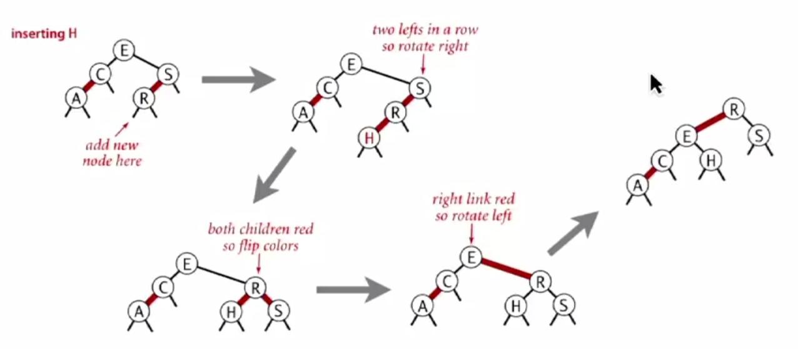
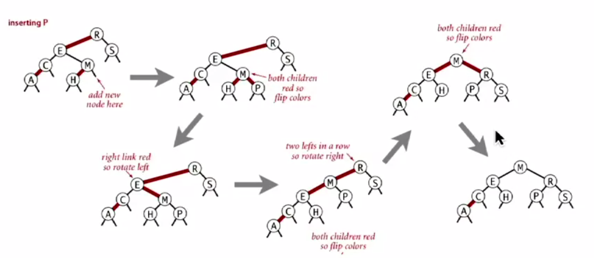

# 2-3 树与红黑树

# 2-3树
## 定义 
2-3树是一棵平衡搜索树
## 节点类型
- 2-节点 
    存放一个值，两个节点
- 3-节点
    存放两个值，三个节点

## api
- search  
    从根节点开始，比节点值小则搜左边，比节点大则搜右边，若是3-节点还可以搜中间  
      
      
- insert  
    先搜索，后插入  
    - 若待插入的点是2-节点  
        则升级2-节点为3-节点  
        
    - 若待插入的点是3-节点  
        则升级3-节点为临时4-节点。接着取临时4-节点的中间值，将其合并到临时4-节点的父节点处  
          
          
        2-3树是平衡搜索树的原因，就在于他新增层数是自底向上的，因此肯定是平衡的

## 效率
1. 查找的时间复杂度：log3N ~ log2N  
1. 节点的合并与升级是常数级操作，因此插入的时间复杂度也是：log3N ~ log2N  
3. 由于他新增层数是自底向上的，因此肯定是平衡的

## demo
  

# 红黑树
## 定义
红黑树是一棵二叉搜索树  
## 特点
- 节点非黑即红
- 根节点是黑色的
- 叶子节点是黑色的
- 不存在两个连续的红色节点
- 从根节点到叶子节点的黑色数量相同  
## 与2-3树的关系
2-3树与红黑树可以互相转换。其转换方式为：**3节点中较大值作为根节点，较小值为其左子节点，且该边为红边**  
  
边的颜色与节点的颜色关系是：**节点颜色代表该节点到其父节点的边的颜色**  
  
完整的转换：
  

## 基础操作
- 左旋：将一个右侧的红边移到左侧（暂时的）  
    
- 右旋：将一个左侧的红边移到右侧（暂时的）  
    
- 变色：对应2-3树中，临时4节点的分裂与合并
      
  
基础操作的目的：维持搜索树的特性以及黑节点的平衡

## insert  
**插入的节点必须是红色节点（2-3树的合并特性）**  
基本策略：插入一个节点后，通过上述基础操作，保证红黑树与2-3树能对应转换  
插入类型：
- 2-节点  
      
      
- 3-节点
      
      
      