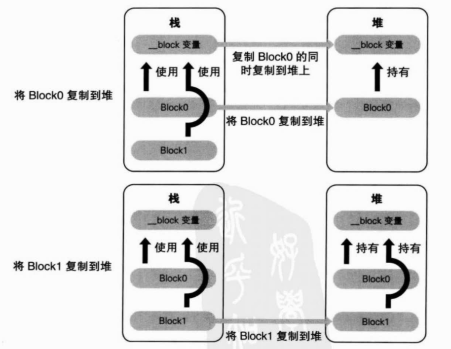
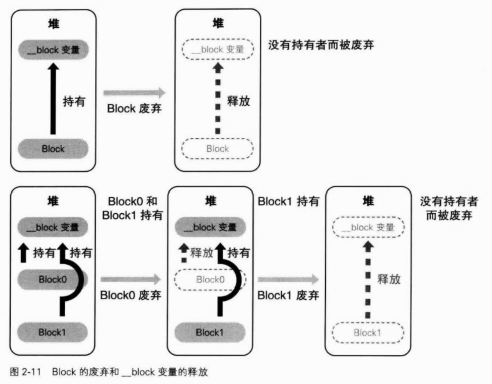

# Blocks
Blocks是带有自动变量（局部变量） 的匿名函数
## 语法
```objc
^int (int val) {
    // todo
}
```
可省略参数列表以及返回值
```objc
// 自动推导返回值类型为int
^(int val) { return val; }

// 省略参数列表
^ { printf("func"); }
```
Blocks变量的声明：将C语言函数指针声明中的`*`改成`^`
```objc
// 变量名字为blk
int (^blk)(int) = ^(int cnt) { return cnt+1; };
```
通过`typedef`简化函数定义
```objc
typedef int (^blk_t)(int);

void func(int (^blk)(int))  // 简化前
void func(blk_t blk)        // 简化后

int (^func()(int))          // 简化前
blk_t func()                // 简化后
```

## 变量的捕获
Block表达式截获定义时自动变量的值，值只读  
```objc
int val = 10;
void (^blk)(void) = ^{ printf("%d", val); };
val = 11;
blk();          // print 10
```
添加`__block`声明，值可写  

## 实现原理
例子
```objc
int main() {
    void (^blk)(void) = ^{ print("Block\n"); }; 
    blk();
    return 0;
}
```
上面的Block由几个部分组成
1. 函数体  
    ```objc
    static void __main_block_func_0(struct __main_block_impl_0 *__cself) {
        printf("Block\n");
    }
    ```
    将Block内的函数体放到一个静态函数中
2. 定制Block结构体  
    ```objc
    struct __main_block_impl_0 {
        struct __block_impl impl;
        struct __main_block_desc_0 *Desc;
        // 截获的变量...
    }
    ```  
    分为一下两个部分
    1. 常规Block结构体
        ```objc
        struct __block_impl {
            void *isa;
            int Flags;
            int Reserved;
            void *FuncPtr;  // 保存函数体指针
        };
        ```
        通用的Block结构，如`isa`，函数指针等
    2. 定制Block描述块
        ```objc
        struct __main_block_desc_0 {
            unsigned long reserved;
            unsigned long Block_size;
        }
        ```
        特定的属于该Block的描述结构，如
    3. Block描述块数据
        ```objc
        static __main_block_desc_0 __main_block_desc_0_DATA = { 
            0, sizeof(struct __main_block_impl_0)
        };
        ```
    4. 截获的变量  
        各种类型变量的存储情况
        - 对于局部变量，值存储
        - 对于全局变量，不进行存储
        - 对于静态局部变量，存储指针

转换后的实现
```objc
struct __main_block_impl_0 blk = 
    __main_block_impl_0(
        __main_block_func_0, 
        &__main_block_desc_0_DATA
    );
(*blk->impl.FuncPtr)(blk);
```  
## `__block`实现
例子
```objc
int main() {
    __block int val = 10;
    void (^blk) (void) = ^{ val = 1; };
}
```
`__block int val = 10`转换为
```objc
struct __Block_byref_val_0 {
    void *__isa;
    __Block_byref_val_0 *__forwarding;      // 指向正确的__block变量（堆/栈）
    int __flags;
    int __size;
    int val;
}

__Block_byref_val_0 val = {
    0,
    &val,
    0,
    sizeof(__Block_byref_val_0),
    10
}
```
`^{val = 1;}`转换为
```objc
static void __main_block_func_0(struct __main_block_impl_0 *__cself) {
    __Block_byref_val_0 *val = __cself->val;
    (val->__forwarding->val) = 1;
}
```
本质上也是保存对象的指针，但是与静态局部变量不一样的是，这个指针并非存到`__main_block_impl_0`中，而是存放到`__Block_byref_val_0`中，这样目的是**一个`__block`变量能被多个Block使用**  

## Block存储域
- 栈：`isa`为`_NSConcreteStackBlock`
- 堆：`isa`为`_NSConcreteMallocBlock`
- .data：`isa`为`_NSConcreteGlobalBlock`

一般Block都存在栈上，存在.data段上的两种情况为：
- Block在全局变量中声明
- Block语法表达式中不截获自动变量
    ```objc
    typedef int (^blk_t)(int);
    for (int rate = 0; rate < 10; ++rate) {
        // _NSConcreteStackBlock
        blk_t blk = ^(int count) { return rate*count; } 
        // _NSConcreteGlobalBlock
        blk_t blk2 = ^(int count) { return count; }
    }
    ```

存在堆上面的情况为：  
变量作用域结束
```objc
blk_t func(int rate) {
    return ^(int cnt) { return rate*cnt; };
}
```
函数返回一个Block，Block在栈上面生成的。当ARC有效时，编译器会自动生成从栈上复制到堆上的代码
```objc
blk_t func(int rate) {
    blk_t tmp = &__func_block_impl_0(__func_block_func_0, &__func_block_desc_0_DATA, rate);
    tmp = objc_retainBlock(tmp);
    return objc_autoreleaseReturnValue(tmp);
}
```
### copy
使用`[blk copy]`的效果：  
- `_NSConcreteStackBlock`：从栈复制到堆  
- `_NSConcreteMallocBlock`：引用计数增加  
- `_NSConcreteGlobalBlock`：什么也不做  

## `__block`变量存储域
**`__block`变量由使用它的Block管理**
  
  
`__block`变量正确访问的原理：  
**使用`__forwarding`成员变量。**当`__block`变量发生复制行为时，正确修改`__forwarding`成员变量  

## 截获对象
当截获的变量是对象时，存放到`__main_block_impl_0`时需要用`__strong`修饰
```objc
struct __main_block_impl_0 {
    struct __block_impl impl;
    struct __main_block_desc_0 *Desc;
    id __strong array;
}
```
除此之外，还有一对`copy`/`dispose`函数，用于管理对象的引用计数。其中`copy`在Block从栈上复制到堆上调用；`dispose`在Block在堆上被废弃时调用  
```objc
static void __main_block_copy_0(
    struct __main_block_impl_0 *dst, 
    struct __main_block_impl_0 *src) {
        _Block_object_assign(
            &dst->val, 
            src->val, 
            BLOCK_FIELD_IS_BTREF);
}

static void __main_block_dipose_0(struct __main_block_impl_0 *src) {
    _Block_object_dispose(src->val, BLOCK_FIELD_IS_BTREF);
}
```
Block从栈上复制到堆上的情况：
- `[blk copy]`
- Block作为函数返回值返回时
- Block赋值给`__strong`修饰符id类型的类或者Block类型成员变脸时  

## `__block`对象
同样，存到`__Block_byref_val_0`时需要用`__strong`修饰
```objc
struct __Block_byref_val_0 {
    void *__isa;
    __Block_byref_val_0 *__forwarding;      // 指向正确的__block变量（堆/栈）
    int __flags;
    int __size;
    void (*__Block_byref_id_object_copy)(void*, void*);
    void (*__Block_byref_id_object_dispose)(void*);
    __strong id obj;
}
```
同样，也生成一对`copy`/`dispose`静态函数，作用相同