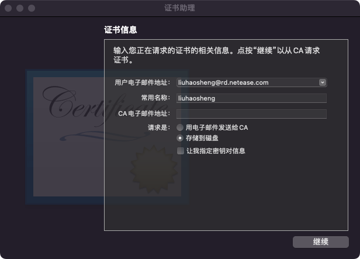
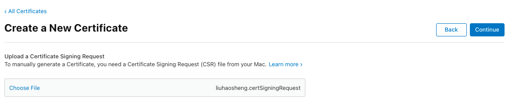
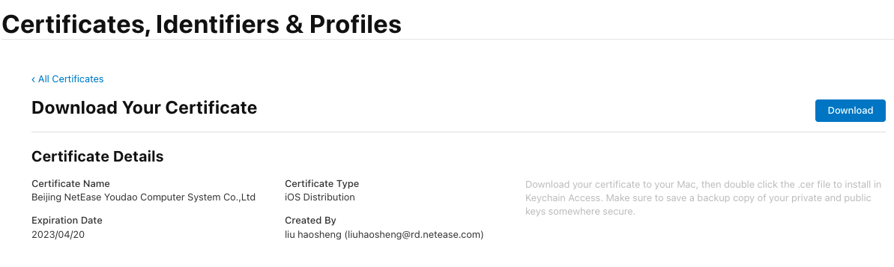
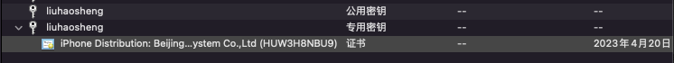
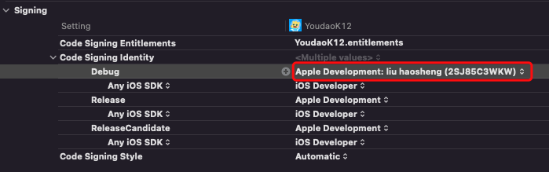
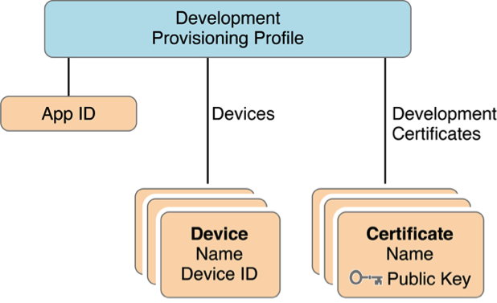
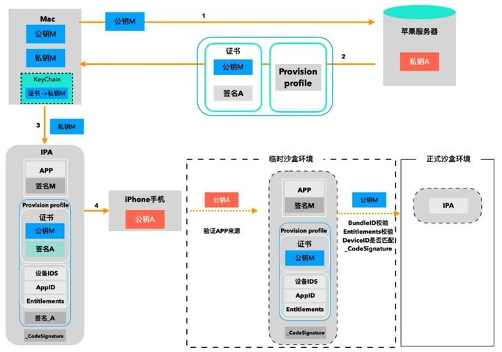

# AppID
## 概念
AppID是应用商店中应用的ID

它由两部分组成
- Team ID  
- Bundle ID  

  

## Bundle ID
它的格式一般为反域名格式，可以分为两种类型：
- Explicit App ID：  
唯一的App ID，用于唯一标识一个应用程序。如“com.youdao.xuetang”
- Wildcard App ID：  
含有通配符的App ID，用于标识一组应用程序，如“com.youdao.*”，但使用这种id的应用不能使用通知功能，所以不常用  

## 配置页面
https://developer.apple.com/account/resources/identifiers/list  

# 设备（Device）
## 概念
设备指的是运行iOS系统用于开发调试App的设备。每台设备使用UDID来唯一标识。  
UDID获取方法：
- Xcode->Window->Devices
- 蒲公英在线获取：https://www.pgyer.com/tools/udid  

## 配置页面
https://developer.apple.com/account/resources/devices/list

# 数字证书（Certificates）
## 概念
由CA机构（Certificate Authority）颁发的，能够在互联网上确定通讯实体身份的证明。  

## 组成
一份简单的数字证书包含以下几部分：
- 名称  
- CA中心的数字签名  
- 公开密钥  
    > 数字签名技术：使用非对称加密，生成一对公钥跟私钥。其中公钥流传在市面上，我们使用私钥对app进行签名，若市面上的公钥能对此app解密，则能证明此app确实由我们开发

数字证书具有时效性

## 类型
- 开发证书
- 发布证书
- 推送证书

## 申请流程
1. 钥匙串访问.app -> 证书助理 -> 从证书颁发机构请求证书，填入信息后会生成CSR(Certificate Signing Request)文件以及一对公私密钥。  
      
    其中CSR文件保存在本地，公钥与私钥保存在 钥匙串访问.app中。CSR文件中会包含公钥。  
      
    > 这里的证书颁发机构为安装Xcode会带上的WWDRCA（Apple Worldwide Developer Relations Certification Authority）
2. 在Apple开发网站上面上传该CSR文件来添加证书  
      
3. Apple证书颁发机构WWDRCA将使用它的私钥对CSR文件中的我的公钥以及一些身份信息进行加密签名成数字证书，并记录在案（Apple Member Center）  
    
4. 下载并安装该证书  
    
    安装后私钥会对应显示他的证书
5. 在 Xcode.app -> Target -> Build Setting -> Code Signing 中使用它
      

## 配置页面
https://developer.apple.com/account/resources/certificates/list

# 供应配置文件（Provisioning Profiles）
## 概念
将证书、AppID、设备信息打包在一起，方便在调试和发布程序打包时使用  
  
Profile决定Xcode用哪个证书签署应用程序，并在应用程序打包时嵌入.ipa包里。安装应用程序时，Profile文件会拷贝到iOS设备中，设备通过它来认证安装的程序  
## 真机调试验证app流程  
1. 验证安装应用程序的Bundle ID与Profile的App ID是否一致  
2. 需要用Profile中的公钥对应用程序验签，保证程序合法，安全，完整  
3. 确认本机是否授权运行该App  
## 组成
典型的Profile文件（.mobileprovision）由下面几部分组成
- Name：文件名
- UUID：唯一文件名
- Team Name：Apple 团队账号名
- Team Identifier：Apple 团队ID
- App ID：Explicit/Wildcard App ID
- Application Identifier Prefix：完整的App ID的前缀（TeamID.*）
- Develop Certificates：包含了所有可以为该配置文件应用签名的所有证书。如果你用了一个不在这个列表的证书进行签名，则无论证书是否有效，这个应用都将CodeSign Fail  
- Entitlements：App权限列表
- Provisioned Devices：授权的开发设备的UDID  

## 配置
https://developer.apple.com/account/resources/profiles/list  

# 签名以及验证流程
  

# 文件总结
- .certSigningRequest（证书申请文件）：  
    来源：钥匙串访问.app 生成  
    作用：包装公钥以及基础信息给苹果服务器验证  
- .cer（证书文件）：  
    来源：苹果开发者网站Certificates下载  
    作用：经过苹果验证的公钥
- .mobileprovision（Profile文件）：  
    来源：苹果开发者网站Profiles下载  
    作用：证书、AppID、设备信息的集合，供开发者打包.ipa文件使用  
- .p12（个人信息共享文件）：  
    来源：钥匙串访问.app 中私钥导出  
    作用：用于在不同机器上共享证书  