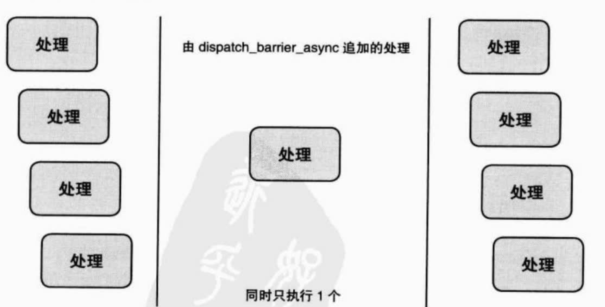

# GCD
Grand Central Dispatch 是异步执行任务的技术之一

## Dispatch Queue
Dispatch Queue的种类：
- Serial Dispatch Queue：阻塞，一个Serial Dispatch Queue对应一个线程  
- Concurrent Dispatch Queue：非阻塞  

系统提供的Dispatch Queue：
- Main Dispatch Queue：属于Serial Dispatch Queue
- Global Dispatch Queue：属于Concurrent Dispatch Queue  

## Dispatch Group
处理Dispatch Queue中多个处理结束后想执行的结束处理  

## API
- `dispatch_queue_create`：创建一个queue  
- `dispatch_retain`：保留  
- `dispatch_release`：释放  
- `dispatch_set_target_queue`：设置queue优先级  
- `dispatch_after`：指定时间后执行处理  
- `dispatch_async`：非阻塞执行
- `dispatch_sync`：阻塞执行
- `dispatch_barrier_async`：在Concurrent Dispatch Queue中，单独处理这个任务  
      
- `dispatch_suspend`：挂起
- `dispatch_resume`：恢复
- `dispatch_semaphore_create`：创建信号量  
- `dispatch_semaphore_signal`：信号量通知  
- `dispatch_semaphore_wait`：信号量等待  
- `dispatch_once`：并发保证执行一次