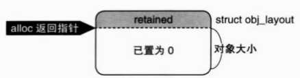
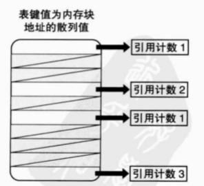

# iOS 中的内存管理
# ARC
自动引用计数（Automatic Reference Counting）  
## 核心方法  
- 生成并持有对象（alloc/new/copy/mutableCopy）  
- 持有对象（retain）  
- 释放对象（release）  
- 废弃对象（dealloc）  

## 实现原理
### 1. GNUstep实现
通过`allocWithZone`分配对象

在对象头部存一份`NSUInteger`类型的引用计数retained  
> NSZone，为了防止内存碎片引入的结构，根据不同容量使用不同的内存区域，简化版的C++ allocator  

### 2. Apple实现
通过HashMap管理对象及其引用计数
  
key为对象内存地址hash值

# AutoRelease
把对象的生命周期与autorelease的生命周期绑定在一起  
## 流程
1. 生成NSAutoreleasePool对象
2. 调用已分配对象的autorelease实例方法
3. 废弃NSAutoreleasePool对象  
## 实现原理
### 1. GNUstep实现
调用`NSAutoreleasePool`的静态方法`addObject`
```objc
- (id) autorelease 
{
    [NSAutoreleasePool addObject: self];
}

// IMP Cache 优化
// 核心理念就是把ObjC动态发送消息给静态实现一遍，提升运行时效率
id autorelease_class = [NSAutoreleasePool class];
SEL autorelease_sel = @selector(addObject:);
IMP autorelease_imp = [autorelease_class methodForSelector:autorelease_sel];

- (id) autorelease 
{
    (*autorelease_imp)(autorelease_class, autorelease_sel, self);
}
```
```objc
+ (void) addObject: (id)anObj 
{
    NSAutoreleasePool *pool = 取得正在使用的Pool对象；
    if (pool != nil) {
        [pool addObject: anObj];
    } else {
        // error
    }
}
```
如何取得正在使用的Pool对象：  
如果NSAutoreleasePool嵌套，则取最里面的，猜测使用了栈记录最里面的Pool对象
```objc
- (void) addObject: (id)anObj 
{
    [array addObject: anObj];
}
```
使用数组记录对象  
### 2. Apple实现
`addObject`行为原理与GNUstep一致；`init`创建对象后，push到static栈中；`drain`释放对象后，pop出static栈  
# 所有权修饰符
变量的定义有两种方式：
```objc
NSObject* obj = [[NSObject alloc] init];
id obj = [[NSObject alloc] init];
```
`id`对应C语言的`void*`。当使用`id`时，需要在前面加上所有权修饰符
```objc
id __strong obj = [[NSObject alloc] init];
```
所有权修饰符的种类有：
- `__strong`：  
    类似于C++中的`std::shared_ptr`，属于默认所有权修饰符  
- `__weak`：  
    类似于C++中的`std::weak_ptr`，解决循环引用问题
- `__unsafe_unretained`：  
    类似于C++中的裸指针，不参与到引用计数中
- `__autoreleasing`：  
    ARC中替代autorelease方法