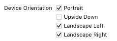
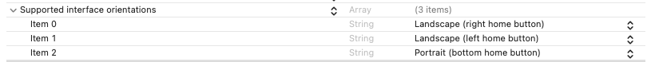

# iOS屏幕旋转

# 设备物理方向
```objc
typedef NS_ENUM(NSInteger, UIDeviceOrientation) {
    UIDeviceOrientationUnknown,
    UIDeviceOrientationPortrait,            // Device oriented vertically, home button on the bottom
    UIDeviceOrientationPortraitUpsideDown,  // Device oriented vertically, home button on the top
    UIDeviceOrientationLandscapeLeft,       // Device oriented horizontally, home button on the right
    UIDeviceOrientationLandscapeRight,      // Device oriented horizontally, home button on the left
    UIDeviceOrientationFaceUp,              // Device oriented flat, face up
    UIDeviceOrientationFaceDown             // Device oriented flat, face down
} API_UNAVAILABLE(tvos);
```
- 通过`[UIDevice currentDevice].orientation`获取
- Readonly
- 当打开系统的锁屏开关时，值只为`UIDeviceOrientationPortrait`

# 界面显示方向
```objc
// Note that UIInterfaceOrientationLandscapeLeft is equal to UIDeviceOrientationLandscapeRight (and vice versa).
// This is because rotating the device to the left requires rotating the content to the right.
typedef NS_ENUM(NSInteger, UIInterfaceOrientation) {
    UIInterfaceOrientationUnknown            = UIDeviceOrientationUnknown,
    UIInterfaceOrientationPortrait           = UIDeviceOrientationPortrait,
    UIInterfaceOrientationPortraitUpsideDown = UIDeviceOrientationPortraitUpsideDown,
    UIInterfaceOrientationLandscapeLeft      = UIDeviceOrientationLandscapeRight,
    UIInterfaceOrientationLandscapeRight     = UIDeviceOrientationLandscapeLeft
} API_UNAVAILABLE(tvos);
```
- 通过`[UIApplication sharedApplication].statusBarOrientation`获取
- `UIInterfaceOrientationLandscapeLeft = UIDeviceOrientationLandscapeRight`：设备向右旋转，界面向左旋转

# 控制界面旋转方向
## 1. 配置
1. 项目配置  
    
2. plist配置  
    

## 2. `AppDelegate`设置
实现下面接口：  
```swift
func application(_ application: UIApplication, supportedInterfaceOrientationsFor window: UIWindow?) -> UIInterfaceOrientationMask {
        return .allButUpsideDown
    }
```

## 3. `UIViewController`设置
重写下面属性： 
- `shouldAutorotate` 
    ```swift
    override var shouldAutorotate: Bool {
        return true
    }
    ```
    Interface方向是否跟随设备方向自动旋转，如果false，则后面两个方法不会掉用
- `supportedInterfaceOrientations`
    ```swift
    override var supportedInterfaceOrientations: UIInterfaceOrientationMask {
        return .portrait
    }
    ```
    返回支持的方向，iPhone默认值为`UIInterfaceOrientationMaskAllButUpsideDown`，iPad默认值为`UIInterfaceOrientationMaskAll`
- `preferredInterfaceOrientationForPresentation`
    ```swift
    override var preferredInterfaceOrientationForPresentation: UIInterfaceOrientation {
        return .portrait
    }
    ```
    返回最优先显示的屏幕方向

## 结果
- `UIViewController`的方向为这三个设置的交集
- 设置3仅在以下两种情况才会生效：
    - 当前`viewController`为`window`的`rootViewController`
    - 当前`viewController`被`presentModalViewController`出来  


# 特殊VC的界面旋转方向 
## `UINavigationController`
当`rootViewController`为`UINavigationController`时，界面的旋转方向由`UINavigationController`控制而并非由push到里面的VC控制
- 网络上面提供的解决方案  
    继承`UINavigationController`，重写其三个方法
    ```swift
    override var shouldAutorotate: Bool {
        return self.topViewController?.shouldAutorotate ?? true
    }

    override var supportedInterfaceOrientations: UIInterfaceOrientationMask {
        return self.topViewController?.supportedInterfaceOrientations ?? .portrait
    }

    override var preferredInterfaceOrientationForPresentation: UIInterfaceOrientation {
        return self.topViewController?.preferredInterfaceOrientationForPresentation ?? .portrait
    }
    ```
- Apple提供的方案  
    实现`UINavigationControllerDelegate`
    ```swift
    func navigationControllerSupportedInterfaceOrientations(_ navigationController: UINavigationController) -> UIInterfaceOrientationMask {
        return self.topViewController?.supportedInterfaceOrientations ?? .portrait
    }
    ```

两种方案的原理实际上是一样的，但是实际展现的效果都有缺陷
> 例如，先往navigationController推一个只支持.landscape的viewController A，然后再推一个只支持.portrait的viewController B。这时候界面并不会在push B的时候立刻变成.portrait，需要旋转一下设备，触发一下系统的回调，才能跑到设置3的回调里面去。pop的时候亦是如此

# 目前的解决方案
```swift
override func viewDidLoad() {
    super.viewDidLoad()
    let value = UIInterfaceOrientation.portrait.rawValue
    UIDevice.current.setValue(value, forKey: "orientation")
    }
```
强制旋转