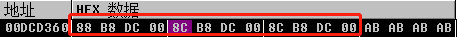

# string
`string`的大小为 **24** 个字节，我们可以把它分成三个部分讨论
1. 字符串内容`content` 
    16个字节，需要分情况讨论
2. 字符串长度`len` 
    4个字节，类型为unsigned int
3. 缓冲区长度`cap`
    4个字节，类型为unsigned int

`content`的表现会跟字符串的长度`len`有关，阈值是**15**。
## 短字符串
长度小于15的，内容直接放到前16个字节上，以`\0`结尾

## 长字符串
长度大于15的，需要在堆上开辟对应长度的内存，然后地址存放在前4个字节上，后面的三个字节不使用

# vector
vector具体的内存布局与其装载的类型有关，这里出于简单起见，以`vector<int>`为例

最上层的大小为**12**个字节，主要存放三个指针
1. 数组起始地址`__MyFirst`
2. 数组结束地址`__MyLast`
3. 缓冲区结束地址`__MyEnd`  

第二层是一个数组，具体大小与装载的类型以及缓冲区大小有关，大小为`sizeof(T) * cap`

# map
`map`具体的内存布局与其装载的类型有关，这里出于简单起见，以`map<int, string>`为例

最上层大小为**8**字节
1. 红黑树地址`ptr`
2. `pair`个数`len`

第二层是

# shared_ptr
`shared_ptr`具体的内存布局与其装载的类型有关，这里出于简单起见，以`shared_ptr<int>`为例