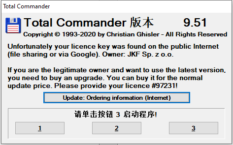

# Total Commander 9.51逆向分析
 Total Commander是一款很好用的文件管理工具。之前一直在用某位大佬给的Total Commander 9.22a，恰好最近正在学习逆向，想找一些软件练一下手，因此索性升级一下Total Commander，顺便尝试分析一下。  

 ## 许可验证
Total Commander是使用KeyFile方式验证。他会读取目录下的wincmd.key文件，进行许可验证。  

在旧版本里，wincmd.key文件的结构如下  
> BLOCK0： 0x0 ~ 0x80       旧版本占位  
BLOCK1： 0x80 ~ 0x100 待解密数据1  
BLOCK2： 0x100 ~ 0x380 待使用  
BLOCK3： 0x380 ~ 0x3F0 待解密数据2  
BLOCK4： 0x3F0 ~ 0x400 哈希值MDX  

其中，待解密数据1解密成0x68字节内存，结构如下
> 0x0  ~ 0x10 后0x57个数据的哈希值  
0x10 ~ 0x13 订单号  
0x13 ~ 0x17 用户数  
0x17 ~ 0x19 区域简称  
0x19 ~ End   用户名|公司|地址 字符串  

最早到8.52a，wincmd.key文件格式一直都没有变化。我需要检查一下，9.51版本是否也是如此。od运行，在CreateFile以及ReadFile下断点，很容易就能找到调用的位置005EE902  
```
CODE:005EE8F6                 lea     edx, [ebp+buffer0]
CODE:005EE8FC                 mov     cx, 400h
CODE:005EE900                 mov     eax, edi
CODE:005EE902                 call    readKeyFile_421DA0
```
可以发现，读取的大小也仍然为0x400，在把这个位置的函数放到IDA里面反编译一下  
```c++
int __usercall check_5EE79C@<eax>(int a1@<eax>, int a2@<ebx>, int a3@<edi>, int a4@<esi>)
{
  ...
  char buffer0; // [esp+D70h] [ebp-590h]
  char buffer80; // [esp+DF0h] [ebp-510h]
  char buffer100; // [esp+E70h] [ebp-490h]
  char buffer200; // [esp+F70h] [ebp-390h]
  char buffer380; // [esp+10F0h] [ebp-210h]
  char buffer3f0; // [esp+1160h] [ebp-1A0h]
  char buffer400; // [esp+1170h] [ebp-190h]
  ...

  if ( v6 )
    sub_421724(hKeyFile, v6, 0);
  readKeyFile_421DA0(hKeyFile, &buffer0, 0x400u, &NumberOfBytesRead);// 从key文件读入400字节
  closeKeyFile_421D30(hKeyFile);

  ...
```
从局部变量的分区可以看到，这400个字节的内存划分的区域刚好跟上面的结构一样。所以文件的结构应该是没有变化的。  
再看看解密数据1的格式是否有变化，下面是对待解密数据1的解密流程
```
CODE:005EEA97                 mov     edx, offset a65537 ; "65537"
CODE:005EEA9C                 mov     eax, [ebp+var_108]
CODE:005EEAA2                 call    BigInDecString_48AE6C
CODE:005EEAA7                 lea     edx, [ebp+copybuffer80]
CODE:005EEAAD                 lea     eax, [ebp+buffer80]
CODE:005EEAB3                 mov     ecx, 80h                      // 大小0x80
CODE:005EEAB8                 call    memcpy_4027C8
CODE:005EEABD                 lea     edx, [ebp+copybuffer80]
CODE:005EEAC3                 mov     ecx, 68h                      // 解密0x68
CODE:005EEAC8                 mov     eax, [ebp+var_118]
CODE:005EEACE                 call    BigInByte_48B028
CODE:005EEAD3                 lea     eax, [ebp+var_11C]
CODE:005EEAD9                 push    eax
CODE:005EEADA                 mov     ecx, [ebp+var_104]
CODE:005EEAE0                 mov     edx, [ebp+var_108]
CODE:005EEAE6                 mov     eax, [ebp+var_118]
CODE:005EEAEC                 call    BigDecrypt_48C840
```
可以看到关键的几个立即数都跟结构大小一样，所以解密结构应该也是没有变化的


## 爆破
找到check_5EE79C之后，我第一个想法是直接暴力破解。爆破比较简单，找关键跳转就可以了~通过OD动态跟踪了一下，最终确定了有两个关键跳转
```
CODE:005EEB56                 mov     esi, eax
CODE:005EEB58                 lea     eax, [ebp+var_180]
CODE:005EEB5E                 mov     [esi+20h], eax
CODE:005EEB61                 lea     eax, [ebp+var_5A0]
CODE:005EEB67                 mov     [esi+24h], eax
CODE:005EEB6A                 mov     dword ptr [esi+28h], 57h
CODE:005EEB71                 mov     eax, esi
CODE:005EEB73                 call    MD5init_45F22C            // 初始化md5环境
CODE:005EEB78                 xor     edx, edx
CODE:005EEB7A                 mov     eax, esi
CODE:005EEB7C                 call    CustomMD5_45FAD0          // 不清楚干了啥
CODE:005EEB81                 mov     eax, esi
CODE:005EEB83                 call    HashOutput_45FBA4         // 计算出MD5
CODE:005EEB88                 mov     eax, esi
CODE:005EEB8A                 call    free_402DA0
CODE:005EEB8F                 lea     eax, [ebp+var_5A0]
CODE:005EEB95                 lea     edx, [ebp+buffer400]      // 取0x400字节的key文件的0x10字节
CODE:005EEB9B                 mov     ecx, 10h
CODE:005EEBA0                 call    StrCmp_402AA4             // 检查MD5是否一致
CODE:005EEBA5                 jz      loc_5EEC59
CODE:005EEBAB                 xor     ebx, ebx                  // Flag
CODE:005EEBAD                 xor     edx, edx
```
另一个也很类似，只不过取0x3F0
```
CODE:005EF046                 mov     esi, eax
CODE:005EF048                 lea     eax, [ebp+buffer380]
CODE:005EF04E                 mov     [esi+20h], eax
CODE:005EF051                 lea     eax, [ebp+var_5A0]
CODE:005EF057                 mov     [esi+24h], eax
CODE:005EF05A                 mov     dword ptr [esi+28h], 70h
CODE:005EF061                 mov     eax, esi
CODE:005EF063                 call    MD5init_45F22C            // 初始化MD5
CODE:005EF068                 xor     edx, edx
CODE:005EF06A                 mov     eax, esi
CODE:005EF06C                 call    CustomMD5_45FAD0          
CODE:005EF071                 mov     eax, esi
CODE:005EF073                 call    HashOutput_45FBA4         // 计算MD5
CODE:005EF078                 mov     eax, esi
CODE:005EF07A                 call    free_402DA0
CODE:005EF07F                 lea     eax, [ebp+var_5A0]
CODE:005EF085                 lea     edx, [ebp+buffer3f0]      // 取0x3F0字节的key文件的0x10字节
CODE:005EF08B                 mov     ecx, 10h
CODE:005EF090                 call    StrCmp_402AA4             // 比较MD5
CODE:005EF095                 jz      short loc_5EF099
CODE:005EF097                 xor     ebx, ebx                  // Flag
```
OD跑到这两个比较上，只要让他们都相等（ZF=1），那么程序就能顺利执行了。值得注意的是，在这两个跳转之间，还有一段黑名单检查的代码（这个后面会说），被检查到的话会清空ebx寄存器。是的，bl寄存器存放的是能否顺利执行的结果，因此我们还需要时刻留意bl的值，需要一直为1。

找到跳转关键点之后，就是打补丁了（总不能一直用od启动吧）。我尝试过直接将两个jz改成无条件跳转jmp，跑是能跑起来，可惜TC有自校验，运行两下就退出了。我原来也想把自校验的代码也揪出来爆破过去，无奈他退出的方式是在是太多了。。有弹个窗退出的，有直接就退出的，有ExitProcess退出的，有WM_SYSCOMMAND退出的，有WM_CLOSE退出的。。反正感觉是修不过来，直接改代码就只能放弃了，以后再研究一下 

那么又要避过他的自校验又要修改代码，只能用DLL劫持的方式来解决了。不过这种方法实现后，每次打开TC都要通过另一个程序打开，实在不完美。需要寻找另一种解决办法。

## 修改黑名单
前面说到，wincmd.key文件格式没变。这意味着，我在9.22a里面的wincmd.key也能在新版本使用！  

然而拷过去之后发现，这个许可已经被9.51拉进黑名单了  
  

在OD上面跟一下，发现就在上面两个跳转之间，有一段黑名单检查代码
```
CODE:005EED31                 mov     eax, offset unk_799818    // 黑名单起始地址
CODE:005EED36
CODE:005EED36 loc_5EED36:                             ; CODE XREF: check_5EE79C+5AE↓j
CODE:005EED36                 cmp     esi, [eax]      // 比较黑名单
CODE:005EED38                 jnz     short loc_5EED46
CODE:005EED3A                 xor     ebx, ebx        // 失败FLAG
CODE:005EED3C                 mov     ecx, esi
CODE:005EED3E                 neg     ecx
CODE:005EED40                 mov     ds:dword_798E04, ecx
CODE:005EED46
CODE:005EED46 loc_5EED46:                             ; CODE XREF: check_5EE79C+59C↑j
CODE:005EED46                 add     eax, 4
CODE:005EED49                 dec     edx
CODE:005EED4A                 jnz     short loc_5EED36
```
往0x799818处一搜，找到了#97231对应的黑名单（0x17BCF）
```
DATA:00799FEC                 db 0CFh
DATA:00799FED                 db  7Bh ; {
DATA:00799FEE                 db    1
DATA:00799FEF                 db    0
```
所以只要把这段数据改一下，这key文件也能在这个版本使用了。但是修改之后会有自校验，那该怎么办呢？这还得感谢这篇[文章](https://bbs.pediy.com/thread-148529.htm)提出的自校验算法分析。找了一下，新版本的自校验算法位置改动了一下，但是主要的思想并没有变化
```c++
int __thiscall checkCRC_5EF6E8(void *this)
{
  char v2; // [esp+0h] [ebp-824h]
  char v3; // [esp+10h] [ebp-814h]
  int v4; // [esp+800h] [ebp-24h]
  int v5; // [esp+804h] [ebp-20h]
  char v6; // [esp+808h] [ebp-1Ch]
  char *v7; // [esp+80Ch] [ebp-18h]
  unsigned __int16 v8; // [esp+810h] [ebp-14h]
  unsigned __int16 v9; // [esp+812h] [ebp-12h]
  void *v10; // [esp+814h] [ebp-10h]
  void *v11; // [esp+818h] [ebp-Ch]
  int v12; // [esp+81Ch] [ebp-8h]
  int v13; // [esp+820h] [ebp-4h]
  int savedregs; // [esp+824h] [ebp+0h]

  v13 = -1;
  v7 = &v3;
  sub_789D28(this, 1023);
  memcpy_4027C8((char *)off_79A03C, &v6, 4);
  v11 = (void *)newString_402698(32769);
  v10 = (void *)sub_42143C(1, 0);
  if ( *((_DWORD *)sub_403604() + 3) )
    v10 = (void *)sub_42143C(1, 64);
  if ( *((_DWORD *)sub_403604() + 3) )
  {
    sub_78EC68((int)&v2, (int)&off_5EF868, 1023);
    v10 = (void *)sub_42143C(1, 0);
  }
  v4 = 0;
  v5 = calcFileSize_41CF34(v10) - 36;
  do
  {
    if ( v5 <= 0x8000 )
      v9 = v5;
    else
      v9 = -32768;
    readKeyFile_421DA0(v10, v11, v9, &v8);      // 从文件中读取0x8000大小的数据块
    if ( !v4 )
      sub_5EF4CC((int)v11, &v5);                // 清除CheckSum和数字签名，计算校验数据大小
    sub_733C54((int)v11, v8, &v13);
    v5 -= v8;
    v4 += v8;
  }
  while ( v8 == 0x8000 && v5 );
  freeSth_4026B0((int)v11);
  readKeyFile_421DA0(v10, &v2, 0x24u, &v8);
  closeKeyFile_421D30(v10);
  v12 = *(_DWORD *)v7 ^ 0x2A67BE65;             // 校验和
  return sub_5EF690((int)&savedregs);
}
```
```
int __cdecl sub_5EF690(int a1)
{
  int result; // eax
  int savedregs; // [esp+0h] [ebp+0h]

  **(_DWORD **)(a1 + 8) = dword_7B3364 * dword_7B3374 + **(_DWORD **)(a1 + 12) - dword_7B335C - dword_7B336C;
  *(_DWORD *)(a1 - 4) ^= 0xF5A3E289;
  sub_5EF570(&savedregs);
  result = dword_7B3368 + dword_7B3364 - dword_7B336C;
  dword_7B3358 = dword_7B3368 + dword_7B3364 - dword_7B336C;
  return result;
}
```
那么我们只需要使用他提供的那种方法，将黑名单改为
```
DATA:00799FEC                 db 0D0h
DATA:00799FED                 db  79h
DATA:00799FEE                 db    2
DATA:00799FEF                 db    0
```
程序就能爆破且不会触发自校验失败的结果了

## 参考文章
https://bbs.pediy.com/thread-210944.htm  
https://bbs.pediy.com/thread-148529.htm  
https://bbs.pediy.com/thread-148671.htm