# Visual Assist X逆向分析
 Visual Assist X是一款很好用的VS插件。尝试了一个月想把它爆破出来，但是还是没有成功。在这里记录一下分析他的过程吧。

# 爆破
安装新版本的VAX后，咱们打开VS，可以发现VAX弹出了一个对话框
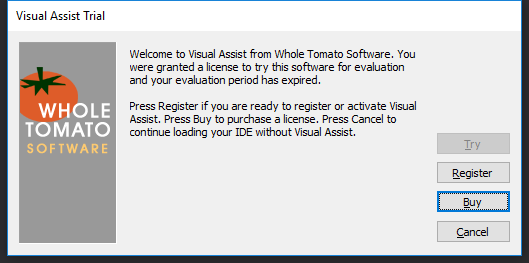
大概意思就是告诉你当前没有注册，只能试用7天或者去注册之类的。关闭对话框之后，所有VAX的组件变灰，不可使用。

从这里我们就能推断出，VAX在启动的时候会检查一下你是否注册，如果没有注册的话，就会弹出一个对话框，之后禁用VAX的组件。既然弹出的是一个标准的对话框，那么就是进行了一次系统调用。我们可以从这里入手，找到VAX弹出对话框的位置。

OD把所有对话框相关的断点打上，再次运行VS。果然程序断在了`CreateDialogIndirectParamA`上。Alt+K查看调用堆栈

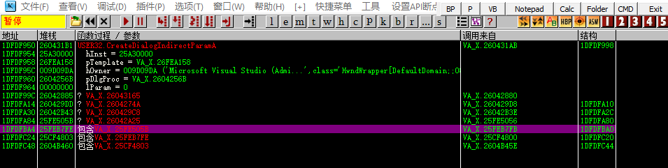
嗯，可以看到几乎所有的调用都跟VA_X.dll有关。接下来就只能一层一层看有没有关键的代码了。
  
在这里我们看到了一个很有趣的地方。在1F2BB783出push了一个注册码，并且下面是“TrialLincense”字符串。很容易就联想到他在这里进行试用的判断，后续或许是判断到你并非试用且没有注册，然后就在1F2BB7FB调用一个函数弹出对话框了。

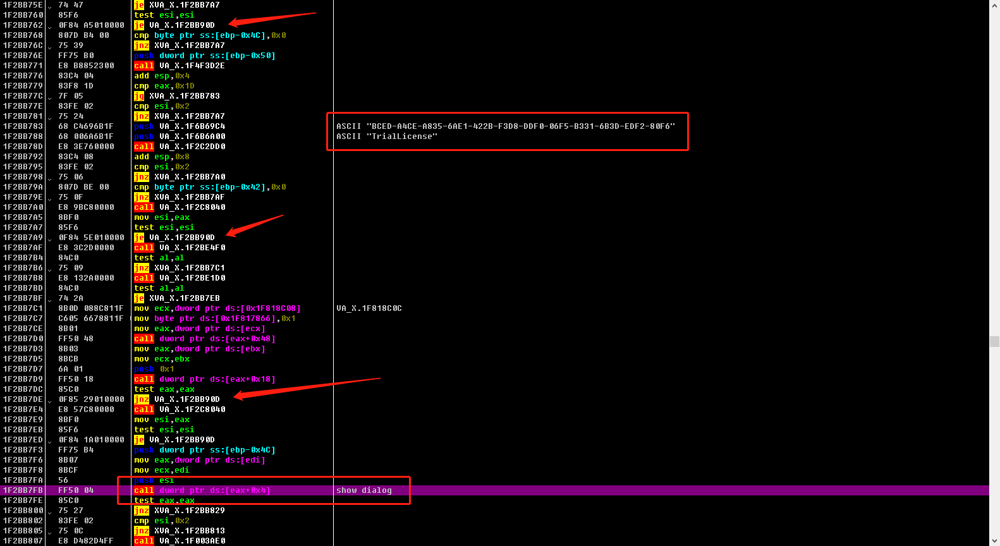

现在只是爆破，那么我们只需要找到关键的跳转能不执行1F2BB7FB处就可以了。接着从下往上开始找，不难发现在1F2BB7ED处以及在1F2BB7A9处以及1F2BB762处都有长跳转，都跳转到90D处，恰好跳过了弹出对话框的函数，或许这就是我们要爆破的关键跳转了。记录一下地址，跑去IDA那边看下反编译代码。

# 释放代码
通过IDA发现，1F2BB7ED也就是处并没有任何代码。那么看来这部分代码是动态释放出来的。ok，跑去OD再验证一下。  
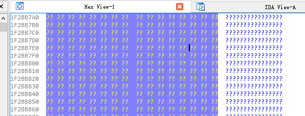

通过下断LdrLoadDll（或者LoadLibraryW），条件断点把参数设置为VA_X.dll的路径，也就是`[UNICODE[ESP+4]]=="C:\\Users\\liuhaosheng\\AppData\\Local\\Microsoft\\VisualStudio\\16.0_0a8600b6\\Extensions\\js2e3enp.vlw\\VA_X.dll"`。运行程序。  

断下来之后，还得Ctrl+F9运行到返回处，这样子VA_X.dll的代码才会被加载到进程里。跳转到1F2BB7ED处发现，果然这块地址刚加载的时候是空白的。  

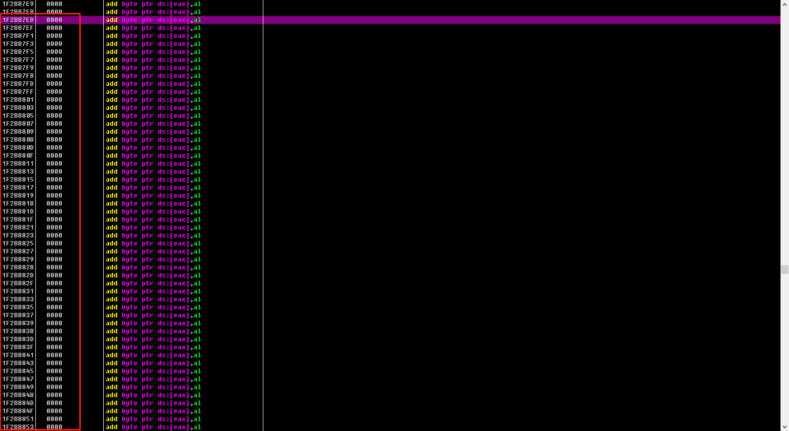

往这个地方下一个内存断点，F9运行。

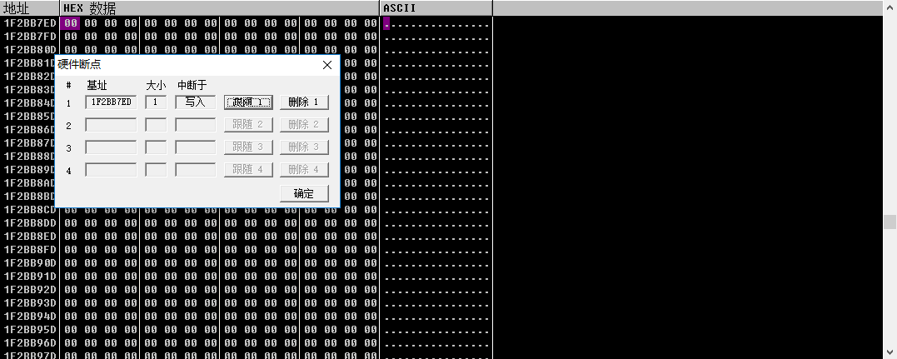

嗯，一下子就断在了给这个代码段赋值的地方了。

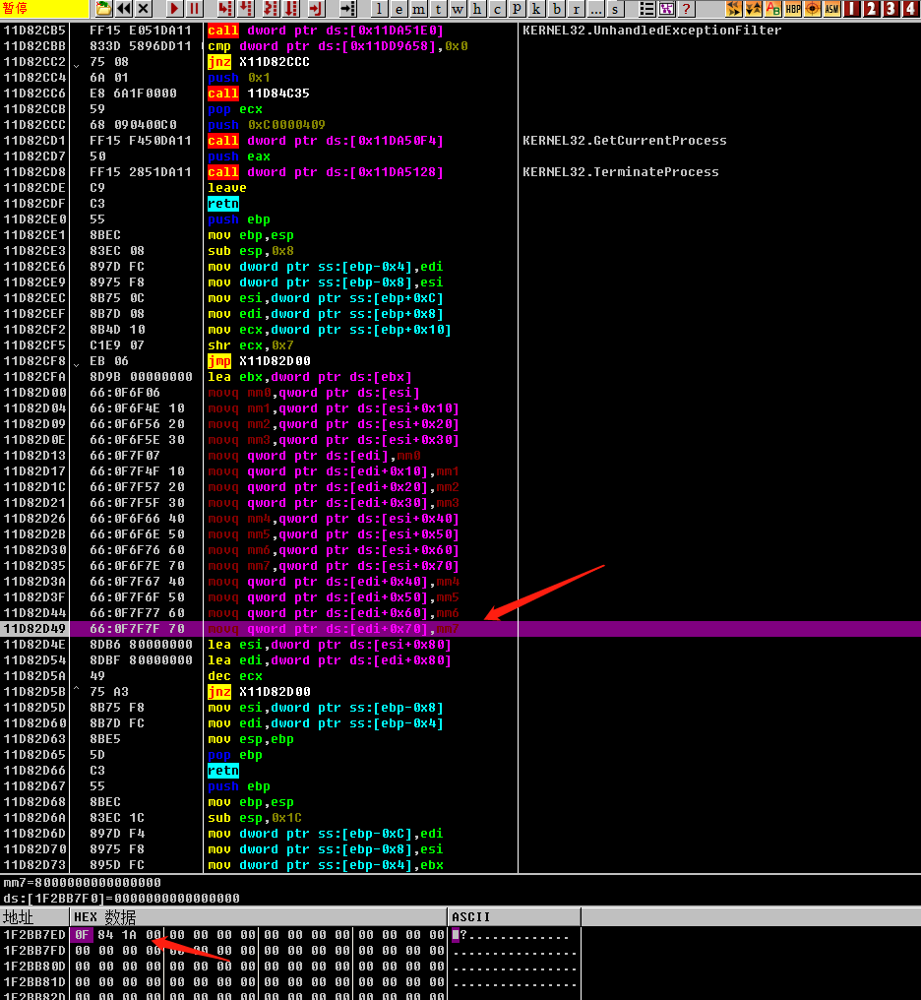

再通过Alt+K查看堆栈。
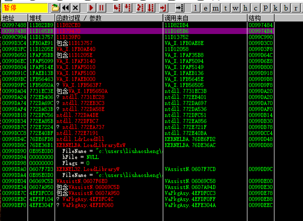

不错，然后就是分析这个堆栈。  

结合IDA，先挑地址控件属于VA_X的看下释放代码的函数在哪里。

可以发现，VA_X.1FB0AE8E处的call属于sub_1FB0AE40这个函数，先暂且命名为releaseCode吧
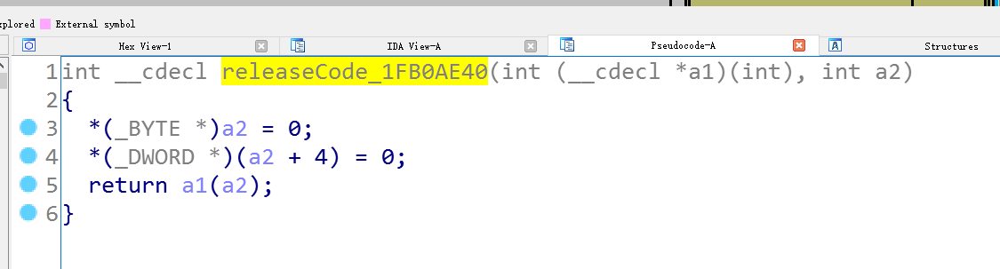

而这个releaseCode通过交叉引用发现，只有在1FAF348F处传了进去，应该是作为回调函数被调用

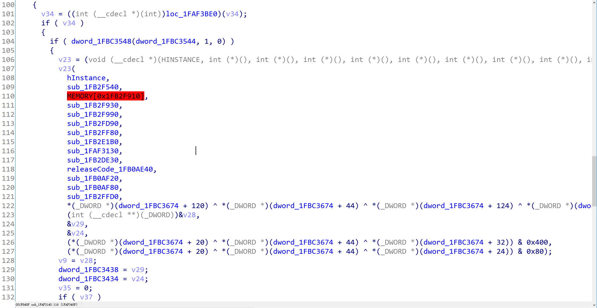
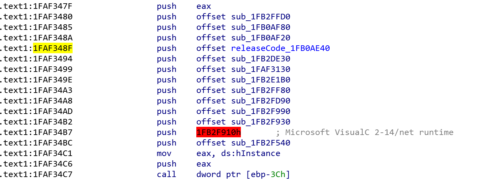

真正执行释放的地方，恰好就是传入回调后，后一点点的代码，也就是1FAF35B8这里，被执行了

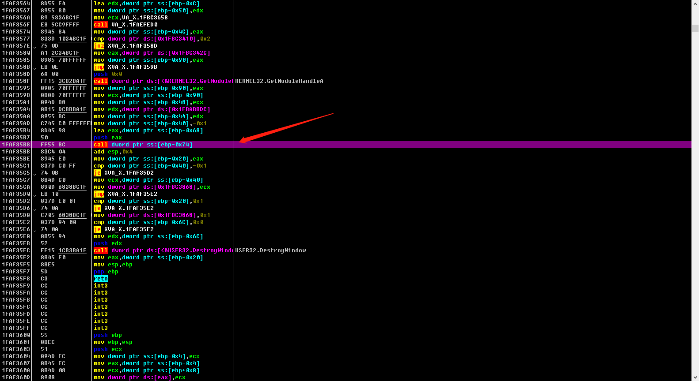

ok，那么我们在1FAF35B8后面那行指令下个断点。断下来之后，那么应该是所有代码都被释放成功了。  

接着修改1F2BB7ED的je指令为jmp指令，验证一下我们的猜想是否正确。F9运行程序。

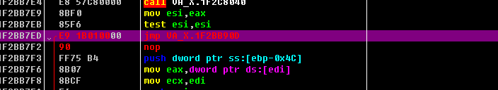

太棒了，现在打开后VA_X没有弹出任何提示框，现在VA_X已经能成功使用了。看看Option，Lincese状态虽然是trial状态，但是后面没有说剩余日期。看来我们的确是绕过去了启动验证

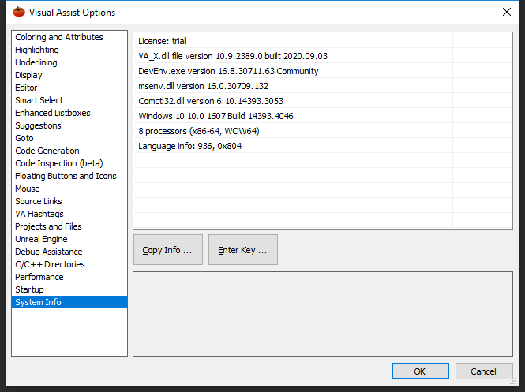

# 破解
前面只是通过OD验证思路，接下来就要写破解程序了  

如果使用DLL劫持的方法的话，比较简单
1. 可以直接hook 1F2BB7ED处，直接将ZF寄存器改为1。那么我们就不用管释放代码的时机了，比较快速
2. 或者直接hook 处，在那边进行一个long jmp，跳转到我们的代码里。在我们的代码中再把1F2BB7ED地址处的je改成jmp，那样子比较麻烦，但是也能达到破解的效果。

但是实际上，方法二的也可以不通过DLL劫持实现。因为方法一要hook的地址是动态释放出来的，因此只能通过DLL劫持。但是方法二的hook的地址是未被压缩的，因此我们可以直接修改该地方的指令，来完成long jmp。

## 

