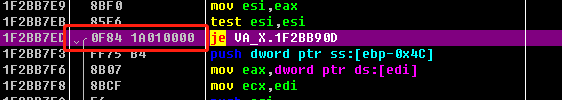

# 破解
上一篇只是通过OD验证思路，接下来就要写破解程序了  

如果使用DLL劫持的方法的话，比较简单
1. 可以直接hook 1F2BB7ED处，直接将ZF寄存器改为1。那么我们就不用管释放代码的时机了，比较快速
2. 或者直接hook 处，在那边进行一个long jmp，跳转到我们的代码里。在我们的代码中再把1F2BB7ED地址处的je改成jmp，那样子比较麻烦，但是也能达到破解的效果。

但是实际上，方法二的也可以不通过DLL劫持实现。因为方法一要hook的地址是动态释放出来的，因此只能通过DLL劫持。但是方法二的hook的地址是未被压缩的，因此我们可以直接修改该地方的指令，来完成long jmp。

## 编写汇编
从上面我们可以看到，将1F2BB7ED处的je改成jmp实际上是将 0F 84 1A 01 00 00 改成 E9 1B 01 00 00 90
 

因为要改动6个字节，因此要写成两句汇编

写成汇编代码如下
```
mov dword ptr ds:[1F2BB7ED], 0x11BE9;
mov word ptr ds:[1F2BB7F1], 0x9000;
```
