# PC微信逆向：崩溃采集
在对PC微信进行二次开发的时候，很容易碰见崩溃。下面介绍两种崩溃采集的方案。
## 使用系统API
我们知道，windows下的异常处理机制有SEH与VEH。

其中，SEH常用的API是`SetUnhandledExceptionFilter`。到IDA里面搜一下，就能找到他设置顶层异常处理函数的地方了
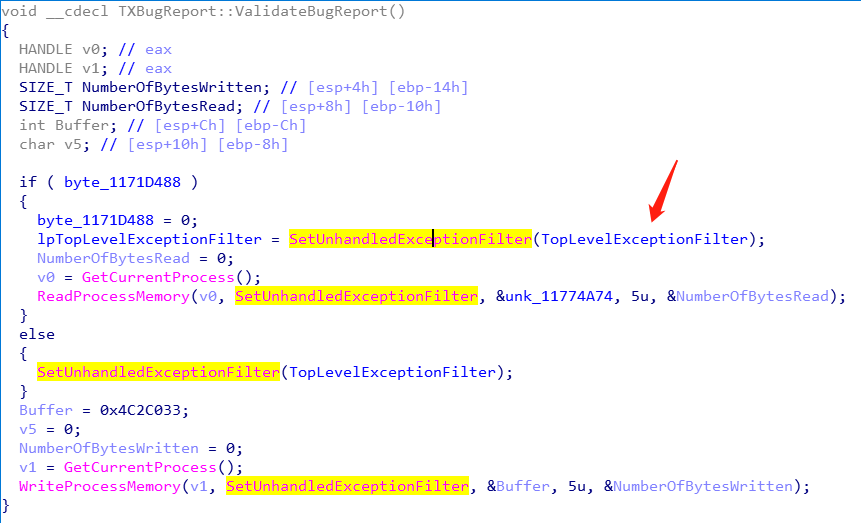

这个`TopLevelExceptionFilter`函数就是微信的顶层异常处理了

至于VEH，常用的API是`AddVectoredExceptionHandler`。先在导入表里面搜一下，没有搜到。但是在字符串表里面，就能搜到。__原因是VEH需要windows xp版本之后的系统才能使用__。微信为了保证系统兼容，于是在运行时调用`GetProcAddress`来获取API地址。
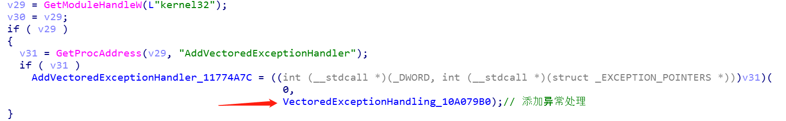

这个地址为0x10A079B0的函数就时微信的VEH异常处理函数了

我们可以使用inline function hook替换这两个异常处理函数，来接管微信异常处理。

## 使用微信自带的崩溃上报程序
### 查看崩溃上报程序
在微信安装目录下，有一个叫做TxBugReport.exe的程序
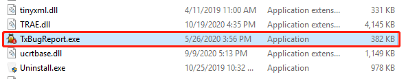
这个程序就是微信自带的崩溃上报程序。__直接双击是并不能打开的__。

在WeChatWin.dll中搜索`"TxBugReport.exe"`字符串，按x查看其交叉引用
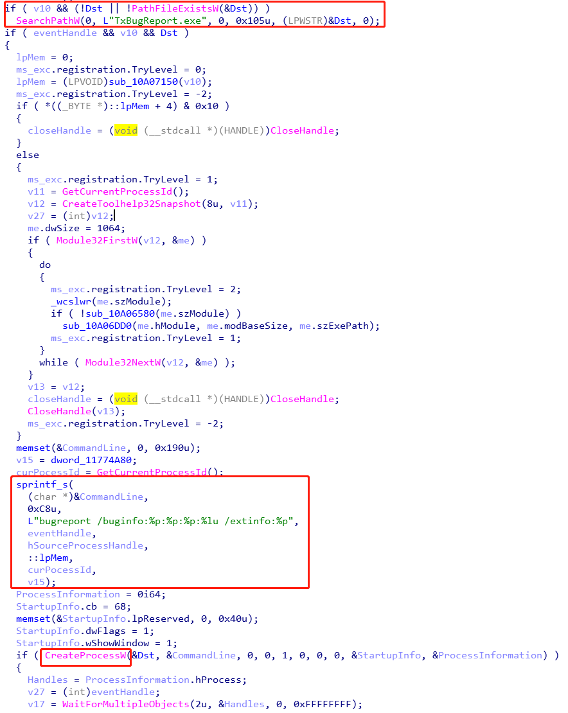
我们发现，在微信内部这个崩溃上报程序是通过`CreateProcess`创建的，并且需要在命令行传入相关数据，才能正确打开这个程序。因此直接双击是并不能打开的。传入的参数包括进程句柄，事件句柄，线程id，还有一个微信内部的全局变量，这些数据都不太好自行构建。所以我们只能在微信处故意写入会导致崩溃的代码，触发一下，才能打开这个程序
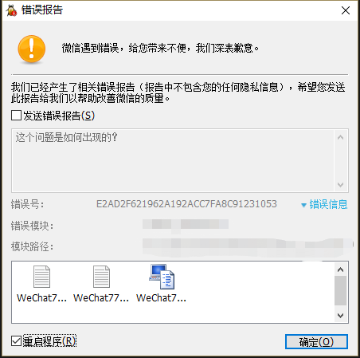
打开之后是这个样子的。下面有生成的dmp文件以及txt文件，我们搜索一下，在`AppData/Local/Temp/Tencent`目录就能找到下面那三个文件
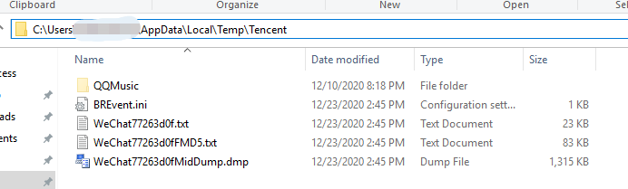
其中：
- BREvent.ini
    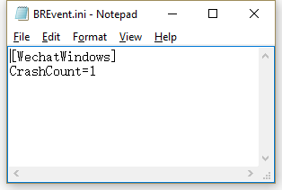
    记录了本机崩溃的次数
- WeChatXXX.txt
    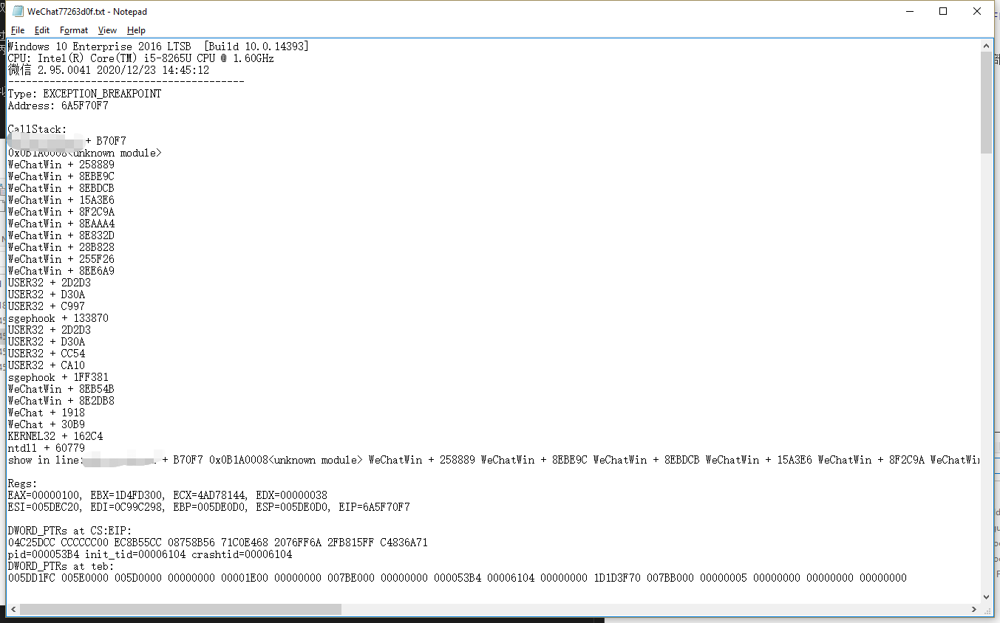
    记录了堆栈信息以及模块信息
- WeChatXXXMD5.txt
    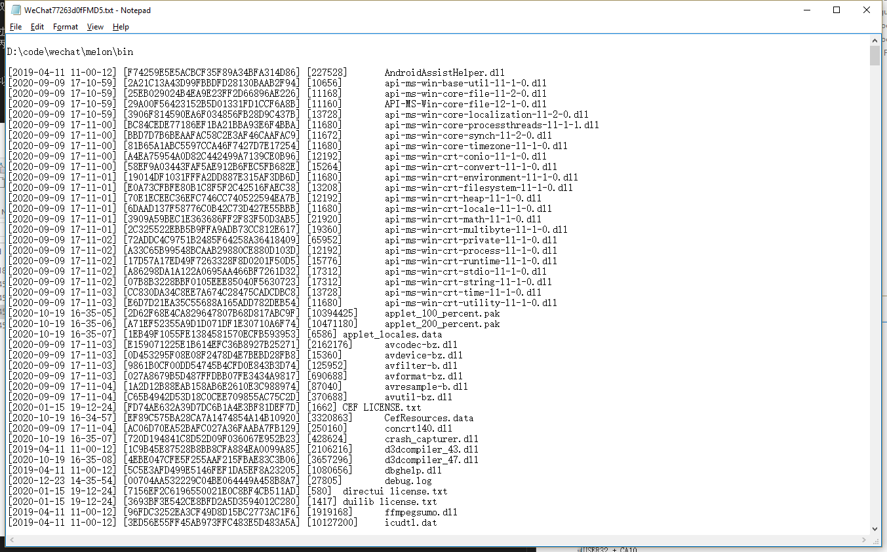
    记录微信运行目录下的所有文件以及其MD5
- WeChatXXXMidDump.dmp
    dmp文件  
  
我们发现，通过微信自带的崩溃上报程序生成的崩溃上报信息还是比较全的，比我们上面替换异常处理函数的要全。
所以我打算，修改这个程序，把他的上报功能去掉，仅仅保留生成崩溃信息的功能为我们所用
### 使用Restorator修改上报程序界面
去掉上报功能，第一步就是把他的上报按钮去掉，避免手抖点错:)

从界面的风格猜测，这是一个MFC程序，因此我们可以使用Restorator打开其资源文件，修改界面布局
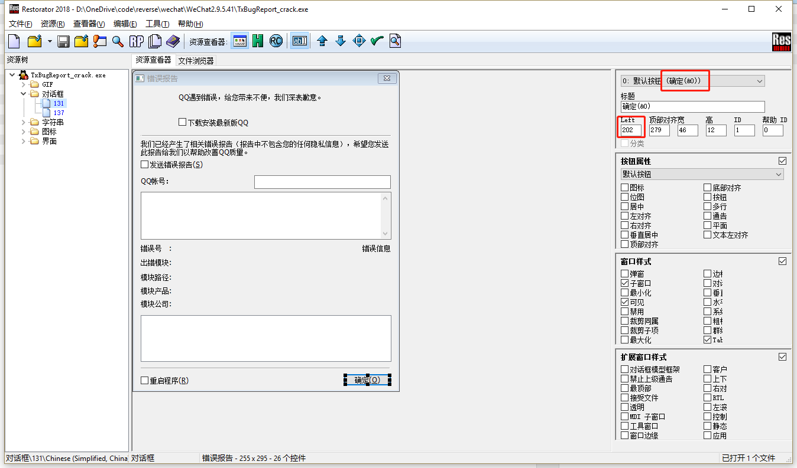
只要找到这个按钮，修改他的坐标至窗口外，就能做到“隐藏”按钮的效果了

讲道理，做到这一步应该就能避免上传崩溃信息了。但是生性多疑的我，不敢相信腾讯的程序~

谁知道他会不会你不点确认，也偷偷把崩溃信息上传上去呢？因此我打开IDA，分析这个程序

### 使用IDA查找上报流程
打开IDA后，先看他的导入表
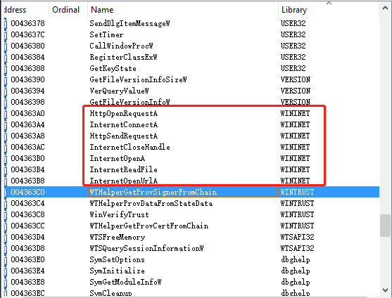
发现关于网络的API就这些，交叉引用看看

发现里面还使用了这个url，猜测这可能就是上报的url了，直接浏览器访问看一下。下载了一个bugreport文件
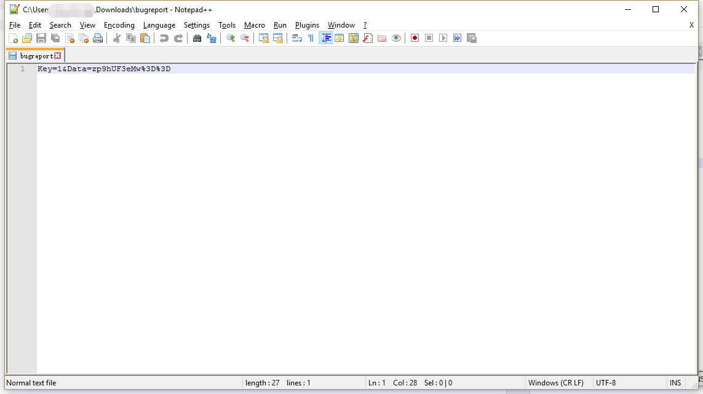
里面是一对Key和Data，在IDA里搜这两个字
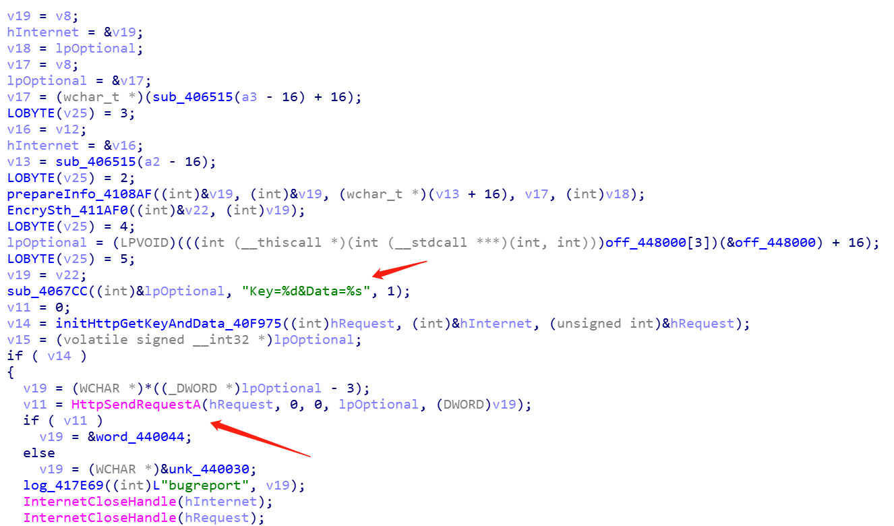
这两个字段感觉仅用于验权，但是会不会对产生dmp信息有用呢，需要做一个小实验确定一下。

> 先联网登录微信，登录成功后，再断网触发崩溃点。结果发现没有网络，咱们的崩溃上传程序仍旧能打开并生成dmp文件。说明这个url并不会影响dmp信息的产生  

知道了这个url后，后面就能使用抓包软件，筛选上报的信息包了
### 使用抓包软件抓崩溃上报程序的网络通讯包
打开Wireshark，触发崩溃，先不点击上报，过滤url
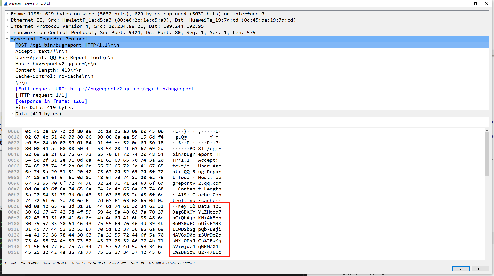
果不其然，发现了一条网络请求。看来他不点击上报，也会先进行一次http请求，把自己的Key和Data先POST到服务器上面。

接下来的关键是，他是否除了这条请求外，是否发送其他数据包。我们可以通过那个http请求的端口，再进行一次过滤
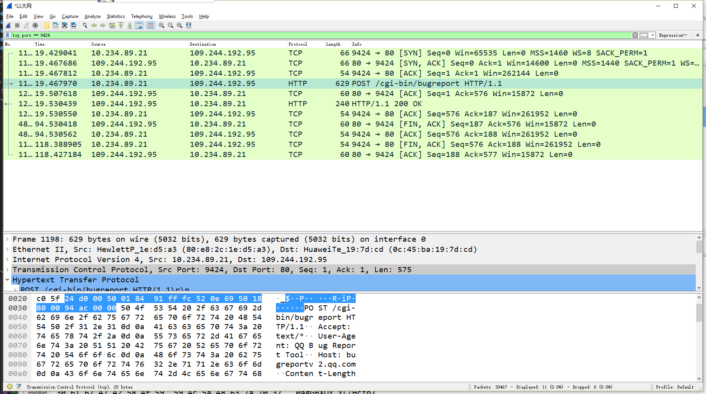
好像还是挺干净的，并没有发送其他数据包。但是多疑的我又怀疑，他是否会换一个端口发送呢？

这时候就要用到NetworkMonitor了。NetworkMonitor是微软出的一个工具，他跟WireShark相比有一个好处就是能够根据进程id筛选报文

打开NetworkMonitor，重复上述操作
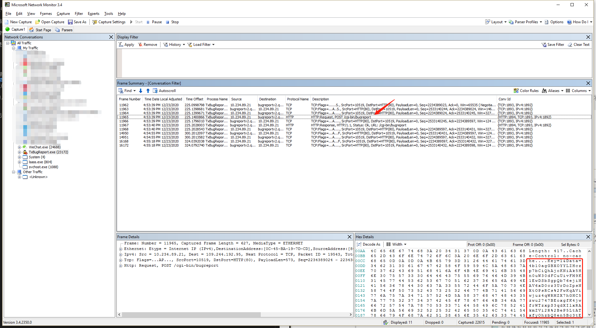
等了半个小时，我们可以看到，除了一条HTTP请求外，崩溃上报程序并没有再传输其他报文了。显示的，也只是前十分钟的时候，服务器与端的TCP握手而已。

虽然这个请求没有什么与崩溃相关的信息，但是他还是请求了微信服务器，会在后台留下记录。这个记录可能会导致微信发现有一个IP频繁请求崩溃的Key&Data，但是一次崩溃信息都没有上传过的异常情况。为了避免这种情况的发生，虽然只有一个请求，但还是把他屏蔽掉比较好

### 修改崩溃上报程序
修改程序的方法有很多种。一开始我使用OD把他调用网络API的地方（所幸不多）nop掉，但试了一下发现会崩溃orz。可能是某些指令涉及到寄存器的赋值，并不能简单nop掉就完事。

恰好在修改资源的时候，发现他的字符串表恰好有那一个上报的url
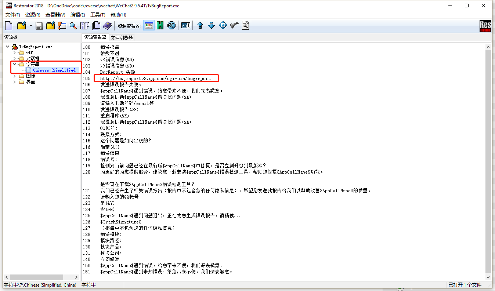
那就尝试一下，把他的域名改成192.168.1.1，看下能不能整歪这个HTTP请求

完成修改后，重复上面的步骤，到NetworkMonitor看一下发送的报文
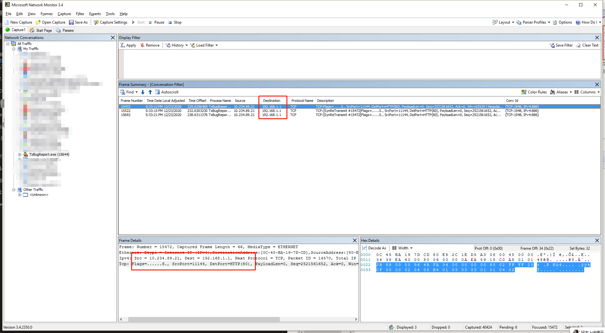
哈哈，看来已经成功把这个请求重定向到自己电脑了~

而且看起来微信并没有备用的url，等了很久都没有其他报文。甚至主动点击上报按钮，也没有发送。

至此，上报程序的复用已经完成~

### 最终效果
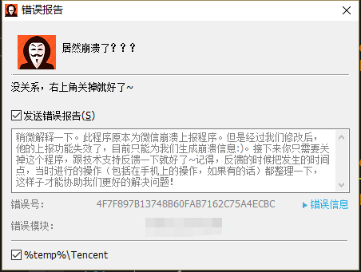