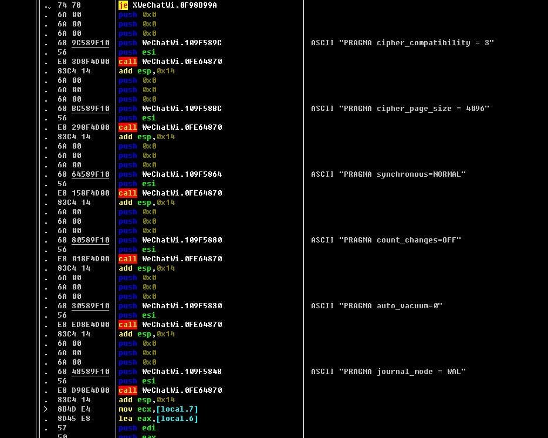
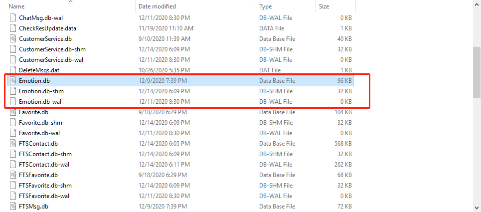

# PC微信逆向：连接微信数据库
关于PC微信数据库的解密，网上都流传着很多不错的文章。然而这些文章都只能教你把数据库解密后访问，并不能让你实时连接加密的数据库，十分不方便。经过一段时间的研究，我找到了可以实时连接微信加密数据库的方法，接下来跟大家分享一下其方法以及思路
# 背景
- [https://blog.csdn.net/qq_38474570/article/details/96606530](https://blog.csdn.net/qq_38474570/article/details/96606530)
- PC微信 2.9.5.41
- IDA
- OD 

# 关于解密数据库的补充
经过上面文章的步骤，现在我们应该可以对微信数据库文件进行解密了。但是解密出来的数据具有很大的滞后性，原因是微信的sqlite使用了WAL模式。WAL模式除了生成一个db文件外，还会生成db-shm文件以及db-wal文件，

对于新增的数据，sqlite并不会直接将其存到db文件中。他会先存到db-wal文件里，然后等待合适的时机再将其同步到db文件中。在我的账号里，这种同步延迟甚至达到了2个月以上。而网上流传的解密算法，仅能对db文件解密，并不能解密db-wal文件。因此该方法具有很大的滞后性。

下面我主要通过两种方法尽量减少这种滞后性
## 1. 通过hook在微信进程中修改sqlite配置
在微信打开数据库之后一点的位置里，还执行了一些sqlite命令

结合函数参数以及类型，我们不难推断出下面那个WeChatWin.0FE64870就是sqlite的C接口`sqlite3_exec`。因此我们从这部分代码入手，通过修改字符串或者插入代码来修改数据库的配置了。比如说：
- 不使用WAL模式：`journal_mode = DELETE`（这个我没有试过）
- 修改checkpoint间隔：`PRAGMA wal_autocheckpoint=1`

## 2. 通过手动checkpoint强行同步db文件
sqlite的WAL机制提供了一个同步接口，命名为`sqlite3_wal_checkpoint`。而微信中的sqlite是静态链接的，所以我们只要找到这个接口，那么我们就能直接调用强行同步db文件。经过一段时间的寻找，最后发现微信对这个接口封装了一层，他的函数叫`DBFactory::InvokeCheckPoint`，可以直接通过搜索字符串定位到此函数。

幸运的是，`DBFactory`类也是一个单例类，调用起来十分简单。写好后跑一下（后面会详细介绍如何调用），发现不行。跟进去看一看，发现并没有跑到checkpoint上。原因是在微信内部这个函数是以定时器的方式调用的，因此其内部还有一层判断两次Invoke间隔的逻辑，直接调用的话会被发现间隔太短从而导致失败。

把这个jb指令改成jmp指令，就可以成功调用了

# 连接数据库
通过上面的方法能查到较实时的数据了。但是毕竟不是使用微信本身的数据库，因此还是有很多不便。我尝试了几种连接数据库的方法，下面一一介绍：

## 1. 在外部进程通过sqlite连接
最直接的想法是使用数据库查看软件直接打开微信加密数据库，我使用的是SQLiteSpy

尝试了一下打开失败。其实也可以理解，因为上面hook取得的密钥是32字节的数据，看起来也不像是字符串。因此硬转成字符串输入肯定会有问题。

既然密钥不能以字符串的形式传进去，那么用代码总归可以了吧。为了尽量保证解密流程一致，最好需要知道微信所使用的加密库以及版本。

从上面的初始化命令行可以知道，微信使用了sqlcipher加密。

至于版本，我们可以从SQL语句出发。在IDA搜SQL语句，例如SELECT * FROM Session，交叉引用，就能调用此语句的sqlite3的C接口了。进去随便翻一下，很容易找到其版本哈希值

那着这个哈希字符串到网上一搜，就能知道sqlite版本了。微信2.9.5.41使用的是2019-4-16编译的sqlite 3.28版本。


编译了sqlite以及sqlcipher，使用`sqlite3_key`打开数据库
```c++
void openWeChatDataBase(const QString& path, void* key) 
{
	static sqlite3* db;
	char pwd[0x20] = { 0 };
	memcpy(pwd, key, 0x20);
	int res = sqlite3_open(path.toStdString().c_str(), &db);
	if (res != SQLITE_OK) {
		return;
	}
	res = sqlite3_key(db, pwd, 0x20);
	if (res != SQLITE_OK) {
		return;
	}
	std::string cmd = "select * from session;";
	char* errMsg;
	res = sqlite3_exec(db, cmd.c_str(), nullptr, 0, &errMsg);
	if (res != SQLITE_OK) {
		output(errMsg);
		return;
	}

	sqlite3_close(db);
}
```
很遗憾，还是打开不了。这里我没多想原因，或许是sqlcipher版本或者加密方式不正确吧

## 2. 通过hook采集微信句柄，通过句柄直接操作数据库
当微信使用sqlite的C接口操作数据库时，这个句柄肯定是符合sqlite规范的。那么我们只要向上寻找，找到这个句柄被生成的地方，采集下来，就能直接使用了。

但是微信有众多数据库文件。为了能减少hook点以及提升准确行性，我们可以研究一下微信关于数据库的设计模式。我们知道微信数据库都是用同一个密钥，因此我们可以从`DBFactory::encryptDB`函数出发，交叉引用查看调用的地方


可以看到函数调用链是：`StorageBase::init`->`DBFactory::openDBbyName`->`DBFactory::encryDB`
至于`StorageBase::init`函数，IDA并没有找到直接调用他的地方，但是在.rdata段找到了多处调用他的地方。随便找一个点进去看看


这个应该是某个类的虚函数表，这个类的名字就是`ContactStorage`。里面记录了`StorageBase::init`函数的地址，运行时会通过虚指针调用此函数。多看几个，发现不少类名跟数据库都有联系，例如




因此不难猜测，设计模式大概是下图这个样子


对于要存放到数据库的数据，微信都抽出了一个XXStorage的类。它继承了`StorageBase`，其`init`函数为虚函数。大多数的XXStorage类都没有重写`init`函数，因此走的都是统一的打开加密数据库流程：先由`StorageBase::init`调用`DBFactory::openDBbyName`（name是第二个参数，大家通过另一个虚函数完成差异化），最后由`DBFactory::openDBbyName`调用sqlite接口以及`DBFactory::encrypt`打开加密数据库。

由于他们都走`DBFactory::openDBbyName`函数，因此可以从此函数下手。下面是IDA的反编译结果

从参数个数以及传参类型可以确定`sqlite3_exec`以及`openDataBase`函数为sqlite接口。经过`DBFactory::encryptDB`后，该句柄就能直接被sqlite3接口使用，说明此时句柄已经被解密。所以我们可以在这个if语句之后把这个句柄采集下来。

至于句柄被释放的代码，我们可以通过字符串定位`DBFactory::closeDBbyName`函数。

里面调用了名为`sqlite3Close`的sqlite内部函数释放句柄。在这里hook可以与保证微信释放句柄后我们不再使用，避免野指针问题。

### 如何确定sqlite接口
可能有人会疑惑，我是怎么确定某个函数为sqlite的C接口的。实际上在上面搜到sqlite的版本之后，我就自己编译了一份相同版本的源码。微信内部的sqlite代码在经过编译之后，变量名以及函数名都会失去其特征，不能作为判定的依据。函数结构会有点相似，但是并不会完全相等，只能当作参考，因为编译器优化会对简短的函数进行内联展开。唯一不变的，是引用到的常量字符串。我们可以从常量字符串入手，借以函数结构为辅助，半猜带撞就能确定sqlite接口

## 3. 自行调用sqlite函数，让微信帮忙解密
分析`DBFactory::openDBbyName`后，发现其实打开数据库的核心流程非常简单
1. 调用`OpenDataBase`函数获得句柄
2. 调用`DBFactory::encryptDB`对句柄进行解密
3. 使用句柄  

因此可以尝试一下，模拟流程调用代码，看下能否成功。  

`OpenDataBase`是sqlite接口，正常调用就好了。问题是`DBFactory::encryptDB`函数，我们需要猜出函数的参数类型以及其数据结构。  

### 第一个参数
通过IDA，我们知道此函数的调用约定是__thiscall，this指针存放在ecx寄存器上

接下来我们找找调用这个类的函数的地方，通过对ecx寄存器的赋值语句，我们就能确定this指针的值

在一处调用`DBFactory::clearAndCloseDBConnection`的地方，我们发现传进ecx的值并不是一个堆上的变量或者是栈上的值，而是一个.data段的偏移。由此我们可以确定这是一个单例，我们只需在调用的地方也同样传入这个.data段的偏移就好了