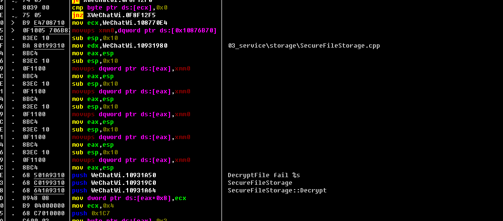
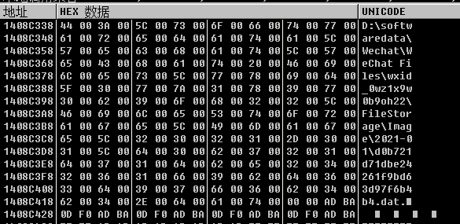
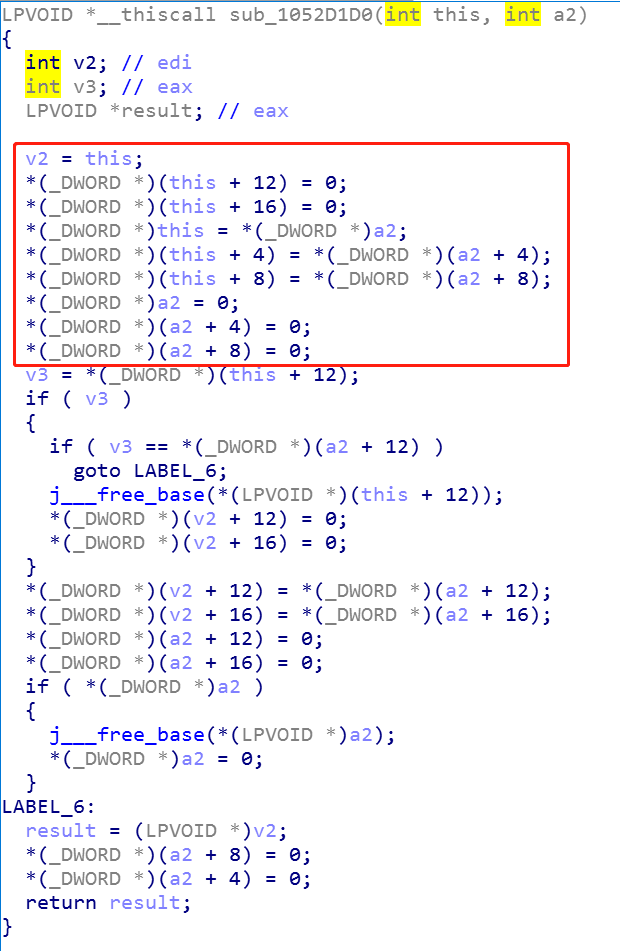

# PC微信逆向：解密微信图片
# 背景
- PC 微信 2.9.5.41
# 开始解密
我们知道，微信的图片是以加密的形式，存放在`WeChat Files\wxid\FileStorage\Image\`下面。  
微信在读取历史记录的时候，对于图片类型的聊天消息，肯定会先从那个文件夹下面找。找到之后经过解密，再展示给用户。  
因此我们可以通过对`CreateFileW`以及`ReadFile`下断点，定位到图片文件解密的代码。  
首先，先对`CreateFileW`下断点，然后点开一张历史图片

确认路径是微信的图片，然后Ctrl+F9执行到返回，记住eax寄存器的值，这是图片文件的句柄

接着对`ReadFile`下断点，运行

确认句柄一致，然后Alt+K查看堆栈

找一下可以发现，WeChatWin.0F8F11C0这个函数特别有意思，他里面用了`SecureFileStorage::Decrypt`字符串

上面还有一个类似文件名的字符串。猜测这些应该都是微信打log用到的__FILE__宏，因此我们可以确定这个函数的名字就是`SecureFileStorage::Decrypt`。从名字来看，这个就是微信解密图片用到的函数了。我们在函数头下个断点，做些操作验证一下。 

经过验证，我们发现以下的操作都会走到`SecureFileStorage::Decrypt`函数：
- 点击一张缩略图展开成大图
- 在大图右键另存为  

其中另存为这个操作，跟我们要直接解密.dat文件流程上有点像，所以我打算从它下手
# 确定参数
在IDA中找到这个函数，反编译一下

发现这个函数还挺麻烦的，调用约定不清楚，用到的参数也比较多。不过IDA也把他用到的寄存器以及参数数量告诉我们了，接下来我们通过调试确认一下具体值是什么。OD在`SecureFileStorage::Decrypt`下断点，右键大图另存为  

先看看通过寄存器传的参

- edx
    
    
    做过PC微信逆向的都知道，这五个字节的结构很显然就是微信的字符串`WXString`。第一个字节是UNICODE字符串指针，第二个字节是字符串的长度，第三个字节是缓冲区大小，最后两个字节保留一般为0。
    所以edx的值是加密图片路径
- ecx
    
    ecx指向一个空地址
- ebp
    跟了一会儿都没发现什么有意义的值，而且我感觉一般ebp都很少作为数据寄存器传值，这里就暂且认为是IDA的误判把

再看看通过压栈传的参

虽说从IDA看起来参数有6个，但是这个堆栈一看，前五个字节的结构，恰好就是一个微信字符串，值就是我另存为的目标图片路径。最后一个字节它也是传了一个0。

所以我们现在可以暂时确定`SecureFileStorage::Decrypt`的调用方式了：
- edx 一个`WXString`类型字符串，字符串的值为加密图片dat路径
- ecx 一个指针，指向NULL
- 通过压栈传的第一个参数 一个`WXString`，值为目标图片路径
- 通过压栈传的第二个参数 一个`int`, 值为0

简单写个代码
```c++
namespace WeChatInternal {
    	struct string {
		wchar_t* str = 0;
		int strLen = 0;
		int bufferLen = 0;
		int fill1 = 0;
		int fill2 = 0;
		void fromString(const std::string& s);
	};
}

void test()
{
	auto addr = GET_ADDRESS(0x5001C0);
	auto pdatFilePath = new WeChatInternal::string;
	pdatFilePath->fromString("d:\\softwaredata\\Wechat\\WeChat Files\\wxid_0wz1x9w0b9oh22\\FileStorage\\Image\\2021-01\\edbdf8621d3d507b43f19c72ac84b2aa.dat");
	auto psaveFilePath = new WeChatInternal::string;
	psaveFilePath->fromString("C:\\Users\\liuhaosheng\\Desktop\\1.jpg");

	int* pUnknow = nullptr;
	auto fill2 = psaveFilePath->fill2;
	auto fill1 = psaveFilePath->fill1;
	auto bufferLen = psaveFilePath->bufferLen;
	auto strLen = psaveFilePath->strLen;
	auto str = psaveFilePath->str;
	__asm {
		push 0;
		push fill2;
		push fill1;
		push bufferLen;
		push strLen;
		push str;
		mov ecx, pUnknow;
		mov eax, psaveFilePath;
		mov edx, pdatFilePath;
		call addr;
	}
}
```

# 一些细节及内部实现
跑了一下上面的测试代码，发现崩溃了，直接说一下结论

dat路径传进去之后，会放到edi寄存器上。而esi存放了一个`WXString`类型的列表。接着微信会比较dat路径与`WXString`列表的每一项，确保dat路径合法（即目录在`WeChat Files\wxid\FileStorage`）下。我也顺手dump了一下esi所指向的列表中的每一项，如下所示
```
124BD9E8  44 00 3A 00 5C 00 73 00 6F 00 66 00 74 00 77 00  D:\softw
124BD9F8  61 00 72 00 65 00 64 00 61 00 74 00 61 00 5C 00  aredata\
124BDA08  57 00 65 00 63 00 68 00 61 00 74 00 5C 00 57 00  Wechat\W
124BDA18  65 00 43 00 68 00 61 00 74 00 20 00 46 00 69 00  eChat Fi
124BDA28  6C 00 65 00 73 00 5C 00 77 00 78 00 69 00 64 00  les\wxid
124BDA38  5F 00 30 00 77 00 7A 00 31 00 78 00 39 00 77 00  _0wz1x9w
124BDA48  30 00 62 00 39 00 6F 00 68 00 32 00 32 00 5C 00  0b9oh22\
124BDA58  44 00 61 00 74 00 61 00 5C 00 00 00              Data\.

1254CD08  44 00 3A 00 5C 00 73 00 6F 00 66 00 74 00 77 00  D:\softw
1254CD18  61 00 72 00 65 00 64 00 61 00 74 00 61 00 5C 00  aredata\
1254CD28  57 00 65 00 63 00 68 00 61 00 74 00 5C 00 57 00  Wechat\W
1254CD38  65 00 43 00 68 00 61 00 74 00 20 00 46 00 69 00  eChat Fi
1254CD48  6C 00 65 00 73 00 5C 00 77 00 78 00 69 00 64 00  les\wxid
1254CD58  5F 00 30 00 77 00 7A 00 31 00 78 00 39 00 77 00  _0wz1x9w
1254CD68  30 00 62 00 39 00 6F 00 68 00 32 00 32 00 5C 00  0b9oh22\
1254CD78  46 00 69 00 6C 00 65 00 53 00 74 00 6F 00 72 00  FileStor
1254CD88  61 00 67 00 65 00 5C 00 49 00 6D 00 61 00 67 00  age\Imag
1254CD98  65 00 5C 00 00 00                                e\.

13688508  44 00 3A 00 5C 00 73 00 6F 00 66 00 74 00 77 00  D:\softw
13688518  61 00 72 00 65 00 64 00 61 00 74 00 61 00 5C 00  aredata\
13688528  57 00 65 00 63 00 68 00 61 00 74 00 5C 00 57 00  Wechat\W
13688538  65 00 43 00 68 00 61 00 74 00 20 00 46 00 69 00  eChat Fi
13688548  6C 00 65 00 73 00 5C 00 77 00 78 00 69 00 64 00  les\wxid
13688558  5F 00 30 00 77 00 7A 00 31 00 78 00 39 00 77 00  _0wz1x9w
13688568  30 00 62 00 39 00 6F 00 68 00 32 00 32 00 5C 00  0b9oh22\
13688578  46 00 69 00 6C 00 65 00 53 00 74 00 6F 00 72 00  FileStor
13688588  61 00 67 00 65 00 5C 00 49 00 6D 00 61 00 67 00  age\Imag
13688598  65 00 5C 00 54 00 68 00 75 00 6D 00 62 00 5C 00  e\Thumb\
136885A8  00 00                                            .

136B17D0  44 00 3A 00 5C 00 73 00 6F 00 66 00 74 00 77 00  D:\softw
136B17E0  61 00 72 00 65 00 64 00 61 00 74 00 61 00 5C 00  aredata\
136B17F0  57 00 65 00 63 00 68 00 61 00 74 00 5C 00 57 00  Wechat\W
136B1800  65 00 43 00 68 00 61 00 74 00 20 00 46 00 69 00  eChat Fi
136B1810  6C 00 65 00 73 00 5C 00 77 00 78 00 69 00 64 00  les\wxid
136B1820  5F 00 30 00 77 00 7A 00 31 00 78 00 39 00 77 00  _0wz1x9w
136B1830  30 00 62 00 39 00 6F 00 68 00 32 00 32 00 5C 00  0b9oh22\
136B1840  46 00 69 00 6C 00 65 00 53 00 74 00 6F 00 72 00  FileStor
136B1850  61 00 67 00 65 00 5C 00 47 00 65 00 6E 00 65 00  age\Gene
136B1860  72 00 61 00 6C 00 5C 00 44 00 61 00 74 00 61 00  ral\Data
136B1870  5C 00 45 00 6D 00 6F 00 74 00 69 00 6F 00 6E 00  \Emotion
136B1880  49 00 63 00 6F 00 6E 00 5C 00 00 00              Icon\.

1249E740  44 00 3A 00 5C 00 73 00 6F 00 66 00 74 00 77 00  D:\softw
1249E750  61 00 72 00 65 00 64 00 61 00 74 00 61 00 5C 00  aredata\
1249E760  57 00 65 00 63 00 68 00 61 00 74 00 5C 00 57 00  Wechat\W
1249E770  65 00 43 00 68 00 61 00 74 00 20 00 46 00 69 00  eChat Fi
1249E780  6C 00 65 00 73 00 5C 00 77 00 78 00 69 00 64 00  les\wxid
1249E790  5F 00 30 00 77 00 7A 00 31 00 78 00 39 00 77 00  _0wz1x9w
1249E7A0  30 00 62 00 39 00 6F 00 68 00 32 00 32 00 5C 00  0b9oh22\
1249E7B0  46 00 69 00 6C 00 65 00 53 00 74 00 6F 00 72 00  FileStor
1249E7C0  61 00 67 00 65 00 5C 00 46 00 61 00 76 00 5C 00  age\Fav\
1249E7D0  54 00 68 00 75 00 6D 00 62 00 5C 00 00 00        Thumb\.

1257A0A0  44 00 3A 00 5C 00 73 00 6F 00 66 00 74 00 77 00  D:\softw
1257A0B0  61 00 72 00 65 00 64 00 61 00 74 00 61 00 5C 00  aredata\
1257A0C0  57 00 65 00 63 00 68 00 61 00 74 00 5C 00 57 00  Wechat\W
1257A0D0  65 00 43 00 68 00 61 00 74 00 20 00 46 00 69 00  eChat Fi
1257A0E0  6C 00 65 00 73 00 5C 00 77 00 78 00 69 00 64 00  les\wxid
1257A0F0  5F 00 30 00 77 00 7A 00 31 00 78 00 39 00 77 00  _0wz1x9w
1257A100  30 00 62 00 39 00 6F 00 68 00 32 00 32 00 5C 00  0b9oh22\
1257A110  46 00 69 00 6C 00 65 00 53 00 74 00 6F 00 72 00  FileStor
1257A120  61 00 67 00 65 00 5C 00 46 00 61 00 76 00 5C 00  age\Fav\
1257A130  44 00 61 00 74 00 61 00 5C 00 00 00              Data\.
```
如果dat路径不在这几个目录下，则微信不会帮你解密图片文件。

上面测试代码的错误，就是盘符写成了小写，导致此判断失败，需要从`d:\\softwaredata\\Wechat\\WeChat Files\\...`改为`D:\\softwaredata\\Wechat\\WeChat Files\\...` Orz

---

修改后再次运行，还是会崩溃，崩溃发生在偏移为0x500557的函数上

我们可以看到第一个参数，他还访问了以this为基址的偏移变量，看来这个this并不是简单的int类型

交叉引用可以发现，这个unknow来源于ecx寄存器，而在我们的测试代码里面，我们误以为他只是一个int类型的空指针
> int* pUnknow = nullptr
mov ecx, pUnknow

因此对一个int*的空指针进行偏移访问肯定是会崩溃的。那这个指针到底是什么类型呢？我们使用OD看一下，在调用完sub_1052D1D0处下断点


原来，unknow是一个`WXString`类型，里面存的是目标图片的保存路径，因此我们把pUnknow的类型改成`WXString*`就好了
# 最终代码
```c++
namespace WeChatInternal {
    	struct string {
		wchar_t* str = 0;
		int strLen = 0;
		int bufferLen = 0;
		int fill1 = 0;
		int fill2 = 0;
		void fromString(const std::string& s);
	};
}

void test()
{
	auto addr = GET_ADDRESS(0x5001C0);
	auto pdatFilePath = new WeChatInternal::string;
	pdatFilePath->fromString("D:\\softwaredata\\Wechat\\WeChat Files\\wxid_0wz1x9w0b9oh22\\FileStorage\\Image\\2021-01\\edbdf8621d3d507b43f19c72ac84b2aa.dat");
	auto psaveFilePath = new WeChatInternal::string;
	psaveFilePath->fromString("C:\\Users\\liuhaosheng\\Desktop\\1.jpg");

	auto pres = new WeChatInternal::string;
	auto fill2 = psaveFilePath->fill2;
	auto fill1 = psaveFilePath->fill1;
	auto bufferLen = psaveFilePath->bufferLen;
	auto strLen = psaveFilePath->strLen;
	auto str = psaveFilePath->str;
	__asm {
		push 0;
		push fill2;
		push fill1;
		push bufferLen;
		push strLen;
		push str;
		mov ecx, pres;
		mov eax, psaveFilePath;
		mov edx, pdatFilePath;
		call addr;
	}
}
```
# 运行结果
