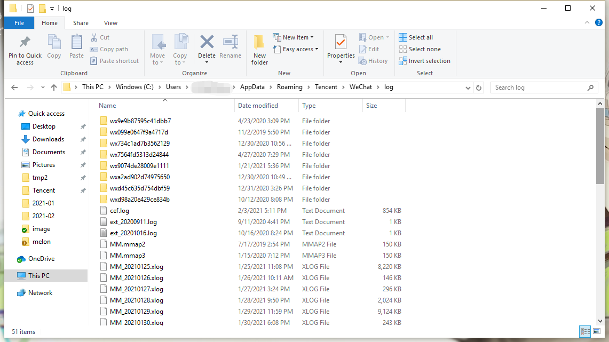
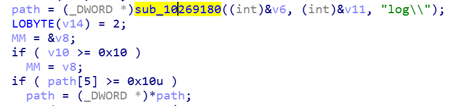
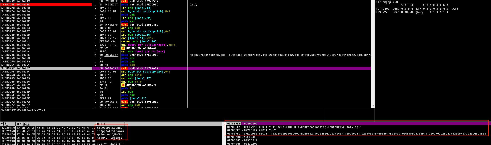

# PC微信逆向：微信Log研究（一）
# 背景
- PC 微信 2.9.5.41
- Mars

# 开始
我们知道微信的日志保存在`%AppData%/Roaming/Tencent/WeChat/log`目录下

里面以`.xlog`为后缀的文件都是加密的日志文件，并不能直接打开  
  
除此之外我们还知道，微信日志使用的是腾讯Mars项目中的xlog模块（[Github地址](https://github.com/Tencent/mars)），下面是官方Wiki中xlog模块的初始化代码
```c++
std::string logPath = "Log"; //use your log path
std::string pubKey = ""; //use you pubkey for log encrypt

#if _DEBUG
xlogger_SetLevel(kLevelDebug);
appender_set_console_log(true);
#else
xlogger_SetLevel(kLevelInfo);
appender_set_console_log(false);
#endif
appender_open(kAppednerAsync, logPath.c_str(), "Sample", pubKey.c_str());
```
从这段代码我们可以看出来，初始化需要传入`log保存路径`以及`加密密钥`。而`log保存路径`我们已经知道了，所以下面看一下能不能通过`log保存路径`定位到微信日志初始化代码  
# 分析&调试
由于`log保存路径`有可能经过多次拼接，因此我采用将路径分段多次搜索的方法，最终在IDA里面定位到可疑代码

OD下断进行调试

发现的确在那一块拼接出了正确的`log保存路径`  

并且在下方不远处，进行一个4个参数的调用：
- 第一个参数是0，通过阅读源码我们知道`kAppednerAsync`宏所对应的值也是0
- 第二个参数是`log保存路径`
- 第三个参数是`MM`，在源码中这个参数是`_nameprefix`，再对应xlog文件的前缀，的确也是`MM`
- 第四个参数是一堆字符串乱码，在源码中这个参数是`pub_key`  

所以我们几乎可以肯定，下方这个`WeChatWin.67E2CDE8`调用就是官方示例中的`appender_open`函数了  

所以PC微信2.9.5.41对应的xlog加密密钥为
> 1dac3876bd566b60c7dcbffd219ca6af2d2c07f045711bf2a6d111a2b1fc27c4df31c1f568879708c5159e370ab141e6627ea028b47f8a5cf4d39ca30d501f81

# 尝试解密
知道密钥后，看下能不能用这个密钥解密xlog文件  

官方给出的解密方法，是使用[log/crypt/decode_mars_log_file.py](https://github.com/Tencent/mars/blob/master/mars/log/crypt/decode_mars_crypt_log_file.py)处的脚本进行解密  

脚本的关键代码如下:
```c++
PRIV_KEY = "145aa7717bf9745b91e9569b80bbf1eedaa6cc6cd0e26317d810e35710f44cf8"
PUB_KEY = "572d1e2710ae5fbca54c76a382fdd44050b3a675cb2bf39feebe85ef63d947aff0fa4943f1112e8b6af34bebebbaefa1a0aae055d9259b89a1858f7cc9af9df1"
```
在文件头它定义了一对公钥与私钥，这个默认的公钥与我们在微信内部找到的公钥不一致，因此不修改脚本直接解密应该是行不通  

找一下这两个变量的引用，发现解密数据块的核心代码
```python
MAGIC_NO_COMPRESS_START = 0x03
MAGIC_NO_COMPRESS_START1 = 0x06
MAGIC_NO_COMPRESS_NO_CRYPT_START = 0x08
MAGIC_COMPRESS_START = 0x04
MAGIC_COMPRESS_START1 = 0x05
MAGIC_COMPRESS_START2 = 0x07
MAGIC_COMPRESS_NO_CRYPT_START = 0x09

MAGIC_END = 0x00

def DecodeBuffer(_buffer, _offset, _outbuffer):
    
    if _offset >= len(_buffer): return -1
    # if _offset + 1 + 4 + 1 + 1 > len(_buffer): return -1
    ret = IsGoodLogBuffer(_buffer, _offset, 1)
    if not ret[0]:
        fixpos = GetLogStartPos(_buffer[_offset:], 1)
        if -1==fixpos: 
            return -1
        else:
            _outbuffer.extend("[F]decode_log_file.py decode error len=%d, result:%s \n"%(fixpos, ret[1]))
            _offset += fixpos 

    magic_start = _buffer[_offset]
    if MAGIC_NO_COMPRESS_START==magic_start or MAGIC_COMPRESS_START==magic_start or MAGIC_COMPRESS_START1==magic_start:
        crypt_key_len = 4
    elif MAGIC_COMPRESS_START2==magic_start or MAGIC_NO_COMPRESS_START1==magic_start or MAGIC_NO_COMPRESS_NO_CRYPT_START==magic_start or MAGIC_COMPRESS_NO_CRYPT_START==magic_start:
        crypt_key_len = 64
    else:
        _outbuffer.extend('in DecodeBuffer _buffer[%d]:%d != MAGIC_NUM_START'%(_offset, magic_start))
        return -1

    headerLen = 1 + 2 + 1 + 1 + 4 + crypt_key_len
    length = struct.unpack_from("I", buffer(_buffer, _offset+headerLen-4-crypt_key_len, 4))[0]
    tmpbuffer = bytearray(length)

    seq=struct.unpack_from("H", buffer(_buffer, _offset+headerLen-4-crypt_key_len-2-2, 2))[0]
    begin_hour=struct.unpack_from("c", buffer(_buffer, _offset+headerLen-4-crypt_key_len-1-1, 1))[0]
    end_hour=struct.unpack_from("c", buffer(_buffer, _offset+headerLen-4-crypt_key_len-1, 1))[0]

    global lastseq
    if seq != 0 and seq != 1 and lastseq != 0 and seq != (lastseq+1):
        _outbuffer.extend("[F]decode_log_file.py log seq:%d-%d is missing\n" %(lastseq+1, seq-1))

    if seq != 0:
        lastseq = seq

    tmpbuffer[:] = _buffer[_offset+headerLen:_offset+headerLen+length]

    try:
        decompressor = zlib.decompressobj(-zlib.MAX_WBITS)

        if MAGIC_NO_COMPRESS_START1==_buffer[_offset]:
            pass
        
        elif MAGIC_COMPRESS_START2==_buffer[_offset]:
            svr = pyelliptic.ECC(curve='secp256k1')
            client = pyelliptic.ECC(curve='secp256k1')
            client.pubkey_x = str(buffer(_buffer, _offset+headerLen-crypt_key_len, crypt_key_len/2))
            client.pubkey_y = str(buffer(_buffer, _offset+headerLen-crypt_key_len/2, crypt_key_len/2))

            svr.privkey = binascii.unhexlify(PRIV_KEY)
            tea_key = svr.get_ecdh_key(client.get_pubkey())

            tmpbuffer = tea_decrypt(tmpbuffer, tea_key)
            tmpbuffer = decompressor.decompress(str(tmpbuffer))
        elif MAGIC_COMPRESS_START==_buffer[_offset] or MAGIC_COMPRESS_NO_CRYPT_START==_buffer[_offset]:
            tmpbuffer = decompressor.decompress(str(tmpbuffer))
        elif MAGIC_COMPRESS_START1==_buffer[_offset]:
            decompress_data = bytearray()
            while len(tmpbuffer) > 0:
                single_log_len = struct.unpack_from("H", buffer(tmpbuffer, 0, 2))[0]
                decompress_data.extend(tmpbuffer[2:single_log_len+2])
                tmpbuffer[:] = tmpbuffer[single_log_len+2:len(tmpbuffer)]

            tmpbuffer = decompressor.decompress(str(decompress_data))

        else:
            pass

            # _outbuffer.extend('seq:%d, hour:%d-%d len:%d decompress:%d\n' %(seq, ord(begin_hour), ord(end_hour), length, len(tmpbuffer)))
    except Exception, e:
        traceback.print_exc()  
        _outbuffer.extend("[F]decode_log_file.py decompress err, " + str(e) + "\n")
        return _offset+headerLen+length+1

    _outbuffer.extend(tmpbuffer)
    
    return _offset+headerLen+length+1
```
每个数据块的头部都有一个魔数，标识这个数据块以什么样的形式进行加密或压缩。只有值为`MAGIC_COMPRESS_START2`也就是`0x07`时，当前数据块才需要解密  

#### 解密的流程：
使用了ECDH算法，椭圆曲线采用`secp256k1`。其中`client`的公钥从数据块中获取，`svr`的私钥从源码中获取。最终两者运算后出来的值，为TEA加密的密钥。随后对数据块进行解密解压就可以得到明文数据了

# 结论
我们上面取得的公钥，应该是`client`的公钥。只有这个公钥，没有`svr`的私钥，是不能运算出TEA的密钥的。至于`svr`的公私钥，目前似乎没有任何迹象可以找到。。所以只能寻求另一种办法了 orz