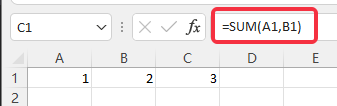

# 从RxSwift开始学习ReactiveX
## ReactiveX简介
`ReactiveX`是`Reactive Extensions`的缩写，一般简称`Rx`。  
`Rx`来自微软，它是一种针对异步数据流的编程。简单来说，它将一切数据，包括HTTP请求，DOM事件或者普通数据等包装成流的形式，然后用强大丰富的操作符对流进行处理，使你能以同步编程的方式处理异步数据，并组合不同的操作符来轻松优雅的实现你所需要的功能。  
目前支持多种编程语言：RxJava、RxJS、Rx.NET、RxScala、RxSwift等  
## 几种编程范式
### 1. 过程式编程
```c
int i = 0;
i = i + 1;
```
十分常见的编程模型，函数语句顺序往下执行，代表语言是C语言  
### 2. 函数式编程
  
函数式编程需要我们把函数作为参数传递，或者作为返回值返还。我们可以通过组合不同的函数来得到我们想要的结果
### 3. 响应式编程
响应式编程是一种面向数据流和变化传播的编程范式  
  
Excel就是一个很好的例子。这里C1单元格的值为`SUM(A1,B1)`。当A1发生变化时，C1就会同步计算出最新的值  
### 4. 流式编程
流式编程通常使用方法链来实现方法级联，目标是提高代码可读性  
具体来说让每个方法都返回它所附加的对象，在调用时能实现“连点”来提高代码可读性。Java中的Stream就是一个很好的例子
```java
List<Long> userIdList = list.stream().map(User::getId).collect(Collectors.toList());
```
### 关系
编程范式之间的关系并不是互斥的，可能一段代码能够包含多种编程范式
```swift
func bindViewModel() {
    viewModel.output.cameraState
        .throttle(0.5, scheduler: MainScheduler.instance)
        .subscribe(onNext: { [weak self] (state) in
            guard let self = self else { return }
            self.updateJoinButtonUI()
        }).disposed(by: self.disposeBag)
}
```
例如这段代码，就包含了面向对象，过程式，函数式，响应式，流式等多种编程范式

## RxSwift核心
RxSwift是Rx在Swift语言下面的实现  
它的核心是观察者模式，开发者需要定义事件在各个节点上面流转时触发的回调。它本身提供多种便利的观察者模式模型，再加以函数响应式编程范式，使得开发效率十分高效  
  
关键角色
- Observable 被观察者，负责产生事件  
- Observer 观察者，负责处理事件  
- Event 事件  

辅助角色
- Operator 变化组合事件  
- Disposable 管理订阅的生命周期  
- Schedulers 线程队列调配  

## Observable
被观察者负责产生事件。  
例如温度，我们可以将温度用`Observable<Double>`来进行描述。每当温度发生变化时，Observable将发出一个温度的事件。如果我们将各个时刻的温度都串在一起，把他看成是一个序列的话，那么实际上被观察者就是一个可监听序列。  
  
由此理念可以推出，**任何可以被观察的事物都可以组成一条序列，当被观察者发生变化时，相当于在队列末尾新增了一个值**  
对于一些只会发生一次的被观察者，也可以组成一条序列，只不过这条序列比较特殊，里面只有一个元素  
### 序列的创建
```swift
let numbers: Observable<Int> = Observable.create { observer -> Disposable in
    observer.onNext(0)
    observer.onNext(1)
    observer.onNext(2)
    observer.onNext(3)
    observer.onNext(4)
    observer.onNext(5)
    observer.onNext(6)
    observer.onNext(7)
    observer.onNext(8)
    observer.onNext(9)
    observer.onCompleted()
    return Disposables.create()
}
```
序列使用`Observable.create`进行创建，`onNext`生成元素  
## Event
```swift
public enum Event<Element> {
    case next(Element)
    case error(Swift.Error)
    case completed
}
```
- next 序列产生了一个新的元素  
- error 创建序列时产生了一个错误，导致序列终止  
- completed 序列的所有元素都已经成功产生，整个序列已经完成  
## Observer
观察者订阅被观察者，对事件进行响应  
例如温度，在与`Observable<Double>`进行订阅之后，可以在`next`事件中进行响应：当温度高于33度时打开空调  
  
### 观察者的创建
```swift
rxTamperature.subscribe(onNext: { [weak self] in
    self?.openAirCondition()
}, onError: { error in
    print("发生错误： \(error.localizedDescription)")
}, onCompleted: {
    print("任务完成")
})
```
最直接的方法：在`Observable`后面调用`subscribe`方法创建观察者并订阅。创建观察者需要三个回调，分别用于处理三种类型的事件  
## Operator
用于变化组合原有队列，从而生成新的序列
```swift
rxTemperature.filter { temperature in temperature > 33 }
    .subscribe(onNext: { temperature in
        print("高温：\(temperature)度")
    })
    .disposed(by: disposeBag)
```
## Disposable
用于管理订阅生命周期
  
## Schedulers
用于管理任务执行的线程队列
  
```swift
// GCD
DispatchQueue.global(qos: .userInitiated).async {
    let data = try? Data(contentsOf: url)
    DispatchQueue.main.async {
        self.data = data
    }
}

// rxSwift
let rxData: Observable<Data> = ...
rxData
    .subscribeOn(ConcurrentDispatchQueueScheduler(qos: .userInitiated))
    .observeOn(MainScheduler.instance)
    .subscribe(onNext: { [weak self] data in
        self?.data = data
    })
    .disposed(by: disposeBag)
```
## RxSwift拓展
### Observable模型
- Single   
    - 要么发出一个元素，要么发出一个error事件  
- Completable  
    - 发出零个元素，要么发出一个error事件，要么发出一个complete事件  
- Maybe  
    - 要么发出一个元素，要么发出一个error事件，要么发出一个complete事件  
- Driver  
    - 对新观察者回放上一个元素  
    - 不会产生error事件  
    - 一定在主线程监听  
- Signal  
    - 不会对新观察者回放上一个元素  
    - 其他与Driver一致  
- ControlEvent  

### Observer模型
- AnyObserver
- Binder  
    - 不会处理错误事件  
    - 确保绑定都在主线程上执行  

### Observable & Observer 模型
有些事物既可以是观察者也可以是被观察者  
例如`textField`的文本，既可以看成用户输入，又可以看成展示给用户的文本。同样的例子还有`UISwitch`、`segmentedControl`、`datePicker`等  
#### AsyncSubject  
- 若源Observable发出error，则对Observer发出error  
    
- 若源Observable发出complete，则对Observer发出最后一个元素以及complete  
      
应用场景：用户频繁操作`datePicker`，但是其回调只需要最后一个元素以及complete/error  
#### PublishSubject
只会对Observer发送订阅之后产生的元素  
   
  
应用场景：订阅报纸，只会发送之后的日报  
#### ReplaySubject  
会对新订阅者补发之前产生的所有元素  
  
应用场景：小班课画板信令同步  
#### BehaviorSubject  
- 订阅时发送源Observable最新的元素，若没有则发送默认的元素  
      
- 订阅时源Observable已经error，则发送error  
      
应用场景：目前还没想到  
## 常用Operator
- filter 过滤  
  
- map 转换  
  
- zip 配对  
  
- flatMap 拍平  
当Observable的元素本身也拥有Observable时，用这个操作符能使他们拍平成一个Observable。像是二维数组经过flatMap后，拍成一维数组