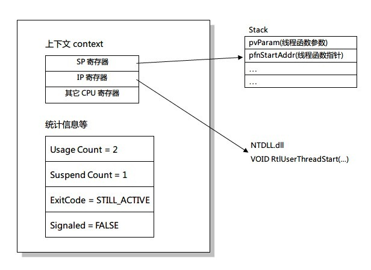

# Windows编程
---
## 内核对象与句柄
### 内核对象定义
- 内核对象是对操作系统各项资源的抽象，比如文件对象，线程对象，进程对象等
- 每个内核对象实际上是一块内存块，只能由内核分配，并由内核访问
- 这块内存块实际上是一个数据结构，其成员维护这对象的相关信息（不同对象结构不同）
### 内核对象的通用属性
- 使用计数，标识有多少个进程正在使用此内核对象，为0时由操作系统释放（保证不存在引用为0的内核对象）
- 安全描述符（SD），描述组和用户的权限
### 句柄定义
- 唯一标识内核对象
- 实际上是指向指针的指针
- 仅与进程相关，不同进程相同内核对象句柄值不一样
- 句柄值实际上是进程句柄表的索引，除以4可以得到具体的索引值
### 进程的句柄表
一个进程在初始化时，系统会为其分配一个空句柄表。句柄表仅供内核对象使用，不适用与用户对象或者GDI对象。大概格式如下

|索引|指向内核对象内存块的指针|访问掩码|标志|
|:--:|:--:|:--:|:--:|
|1|0x????????|0x????????|0x????????|
|2|0x????????|0x????????|0x????????|

- 创建一个内核对象时，操作系统会为内核对象分配内存块，同时写入句柄表空的记录项中
- 关闭一个内核对象时，使用`CloseHandle`函数。忘了关闭内核对象在进程运行期间可能会发生对象泄露，但是在进程结束时操作系统会绝对保证释放所有资源
### 进程共享内核对象
- 对象句柄继承
    - 只允许父子进程之间继承
    - 句柄表中每个记录项都有一个是否可以继承的标志位
    - 创建子进程`CreateProcess`中有个bool值表明是否允许子进程继承父进程中可继承的句柄项
    - 继承后父子句柄表中可继承的句柄具有相同的索引（即相同句柄值）、访问掩码以及标志位
    - 传递句柄值的方法：命令行、IPC、环境变量
- 为对象命名（在创建时有pszName参数）
    - Windows不提供机制保证命名唯一， 因此建议使用GUID命名
    - 可以通过命名空间隔离
- 复制对象句柄   
使用`DuplicateHandle`函数，一般涉及到三个进程：Source进程，Target进程，以及C进程（催化剂）。函数需要4个句柄：目标进程句柄（相对于C进程）、复制句柄（相对于Source进程）、目标进程句柄（相对于C进程）、复制后的句柄地址（相对于C进程）。在这里最好不要关闭复制后的句柄，因为当复制的内核对象与C进程其中一个内核对象相同时，这就意味着关错句柄。
## 进程
### 定义
一个正在运行的程序的实例
### 构成
- 内核对象，操作系统用于管理进程
- 地址空间，包含可执行文件以及dll的代码和数据、动态内存分配（堆栈）
### 使用`CreateProcess`创建进程
1. 系统创建进程内核对象，并将其引用计数设为1
2. 系统为新进程开辟虚拟地址空间，将所有可执行文件及dll中的代码及数据加载进去
3. 系统创建线程内核对象，并将其引用计数设为1
4. 主线程调用入口函数（_tmain, _tWinMain）
5. 成功返回true
### 终止进程
- 主线程入口函数返回
只要主线程入口函数返回，不管进程是否存在其他线程，C/C++运行库会调用`ExitProcess`终止进程，退出代码为入口点函数返回值。除此之外，只有这种方法能保证C++对象析构函数正确执行，以及正确释放线程栈的内存
- 进程中一个线程调用`ExitProcess`
- 其他进程中的线程调用`TerminateProcess`
- 进程中所有线程死亡
### 进程终止时操作系统依次执行的操作
1. 终止进程中遗留的所有线程
2. 释放进程分配的所有用户对象以及GDI对象，关闭所有内核对象
3. 进程的退出代码从STILL_ACTIVE变为`ExitProcess`或`TerminateProcess`的代码
4. 进程内核对象状态变为已触发状态
5. 进程内核对象引用-1
### 小知识
- 线程ID与进程ID分享同一个号码池
- 关闭线程句柄或者进程句柄不会引起线程或进程立即终止，只是表明不感兴趣而已
- 进程终止不代表进程内核对象释放，有可能其他进程在监视此进程信息（比如进程运行时间）
## 作业
### 定义
是一种内核对象，可以想象为进程容器，允许我们对里面的进程加以限制
### 限制的类型
- 基本限额和扩展基本限额，防止作业中的进程独享系统资源
- 基本UI限制，防止进程修改用户界面
- 安全现额，防止进程访问安全资源（注册表、文件等）
### 操作
- 将进程放入作业中`AssignProcessToJobObject`
- 终止作业中所有进程`TerminateJobObject`，类似于为作业中每个进程调用`TerminateProcess`
- 查询作业信息`QueryInfomationJobObject`
- 作业通知，发送作业中的各种事件
## 线程
线程描述进程内部的一条执行线路
### 构成
- 线程内核对象，操作系统用它管理线程
- 线程栈，维护线程执行时所需的所有函数参数以及变量
### 线程函数
```c++
DWORD WINAPI ThreadFunc(PVOID pvParam){
    DWORD dwResult = 0;
    // Do
    return dwResult;
}
```
必须返回一个值，他是线程的退出代码
### 创建线程
- Windows函数`CreateThread`
- Microsoft C++运行库`_beginthreadex`（C++应该使用这个）
#### `CreateThread`和`_beginthreadex`的区别：
`CreateThread`是Windows创建线程的接口，而`_beginthreadex`是C++运行库的函数。由于当年C++运行库没有考虑到多线程环境，因此使用`CreateThread`创建的线程有可能会修改其他线程的变量（比如`errno`）。所以C++运行库提供一个创建线程的函数`_beginthreadex`，他在运行库堆上为每个线程创建结构体`_tiddata`，里面保存与线程相关的数据。接着`_beginthreadex`会调用`CreateThread`，函数地址传的是`_threadstartex`，参数地址传的是`_tiddata`。最后在调用`_threadstartex`时会将`_tiddata`与线程关联一起。
### 终止线程
- 线程函数返回   
同样的，只有这种方法才能正确执行C++对象的析构函数，正确地释放线程栈内存
- 线程调用`ExitThread`（不会销毁`_tiddata`，`_endthreadex`才会）
- 其他线程调用`TerminateTherad`
- 包含此线程的进程终止
### 线程终止时操作系统执行的操作
- 释放线程拥有的用户对象句柄（窗口window、挂钩hook）
- 退出代码从STILL_ACTIVE变为`ExitThread`或`TerminateTherad`的退出代码
- 线程内核状态变为触发状态
- 若线程是进程中最后一个线程，则进程也终止
- 线程内核对象引用计数-1
### 线程内幕


1. 系统在`CreateThread`后会创建一个线程内核对象，并将属性设置成如图所示（挂起）
2. 从进程空间中分配线程堆栈内存，并将线程函数参数、线程函数指针依次写入栈中
3. 线程上下文即是线程的一组CPU寄存器（CONTEXT结构），其中设置堆栈指针寄存器（SP）为线程函数指针，指令指针寄存器（IP）为`RtlUserThreadStart`或`BaseThreadStart`（32位Kernel32.dll）
4. 线程取消挂起，交给一个处理器执行，系统在实际的寄存器中加载线程的上下文之后就可以执行代码了
5. 由于IP为`RtlUserThreadStart`，所以线程是从`RtlUserThreadStart`开始
    - 设置结构化异常处理帧(SEH帧)，用于处理线程执行期间产生的异常
    - 调用线程函数，将pvParam传给他
    - 线程函数返回时，调用`ExitThread`传递返回值，线程引用-1，然后线程停止执行
#### CONTEXT的作用
记住线程的状态，使得线程在下一次获得CPU时，能从上次停下来的地方继续
### 线程挂起
一个线程可以被多次挂起，最多可以挂起127次
- 创建线程时传入CREATE_SUSPENDED标志挂起    
- 通过`SuspendThread`将挂起计数+1
这种方法需要知道目标线程在干什么，如果目标线程在分配堆内存，很容易会造成锁定堆
### 线程恢复
通过`ResumeThread`将挂起计数-1
### 线程睡眠
```c++
VOID Sleep(DWORD dwMilliseconds);
```
表示线程将自己挂起dwMilliseconds长的时间。同时，他也放弃了在调用`Sleep`后自己时间片剩下的时间。值得注意的是，线程并不一定在dwMilliseconds时间后醒来，这取决于系统其他线程的情况。当值为0时，表示他放弃自己时间片中剩下的部分，当然系统在下一时间片时有可能调用到它（因为它没挂起）。
### 线程优先级
线程优先级分为0~31个级别，系统总是会令高优先级的线程抢占低优先级的线程。页面清零线程是唯一一个优先级为0的线程，负责在没有进程调度的时候将内存中的闲置页面清零。   
6种线程优先级类：idle, below normal, normal, above normal, high   
7种进程优先级类：idle, lowest, below normal, normal, above normal, high   
Windows就是通过这13中抽象优先级类，映射出线程基本优先级。除此之外，Windows还会动态调整线程优先级。比如I/O事件、窗口消息、前后台切换，系统会适量提高优先级。可以通过`SetProcessPriorityBoost`或`SetThreadPriorityBoost`启动或禁用动态调整。
### 线程同步
#### 问题
一个全局变量`g_x`在自增时`g_x++`，汇编代码其实是这样子的：
```
MOV EAX, [g_x]  ; 将g_x的值放进寄存器
INC EAX         ; 寄存器自增
MOV [g_x], EAX  ; 将寄存器值放回g_x
```
由于`g_x++`不是不是原子操作，因此在多线程环境下不能保证值的一致性
#### 解决方案（用户模式）
##### Interlocked系列函数
他是Windows提供的一组原子性操作。比如`InterlockedExchangeAdd`函数可以进行原子性的加法。在x86的CPU环境里，他实际上是通过在总线上维持一个硬件信号，这个信号会阻止其他CPU访问同一个内存地址实现的。
##### 锁
- 自旋锁   
自旋锁和一般锁的区别是：在资源被占用时，他并没有阻塞，而是一直循环访问
一定要为资源加上`volatile`关键字，否则自旋锁容易死锁
它假定资源只会占用一小段时间，相比于切换到内核模式等待，循环访问等待的时间更少
在单CPU环境应该避免使用自旋锁，因为自旋会阻碍占用资源的线程释放资源
- Slim读写锁（SRWLock）   
读线程共享模式访问，写线程独占模式访问
##### 关键段（CRITICAL_SECTION）
Interlocked系列函数只能针对简单数据类型，当涉及到复杂的数据结构时就不能使用。此时可以使用关键段：
```c++
CRITICAL_SECTION g_cs;
int g_i;
void func(){
    EnterCriticalSection(&g_cs);    // 注意是指针
    g_i++;
    LeaveCriticalSection(&g_cs);
}
```
只需要定义一个`CRITICAL_SECTION`结构体，然后使用`EnterCriticalSection`进入，`LeaveCriticalSection`退出就ok了。个人感觉有点像加锁。
关键段在Windows的实现中，使用到了自旋锁。在一定时间内自旋锁访问不了资源的话，将会切换到内核模式等待。
##### 条件变量（CONDITION_VARIABLE）
条件变量需要结合一个读写锁（SRWLock）或者关键段。使用条件变量能使线程在条件成立之前以原子方式将锁释放并将自己阻塞。
#### 解决方案（内核模式）
内核模式与用户模式相比适用性更广，但是性能开销比较大（涉及到用户状态到内核状态的切换，大概200个CPU周期）。内核对象内部有一个bool变量，用于记录触发状态。线程内核对象在创建时总是处于未触发状态，当线程终止时变为触发状态，触发状态不能返回到未触发状态。
##### 等待函数
使一个线程自愿进入等待状态，直到指定的内核对象被触发为止
```c++
DWORD WaitForSingleObject(HANDLE hObject, DWORD dwMilliseconds)
DWORD WaitForMultipleObjects(DWORD dwCount, CONST HANDLE* phObjects, 
                            BOOL bWaitAll, DWORD dwMilliseconds)
```
返回值可以为`WAIT_OBJECT_0`，`WAIT_TIMEOUT`，`WAIT_FAILED`等
##### 事件内核对象
创建一个事件
```c++
HANDLE CreateEvent(PSECURITY_ATTRIBUTES psa,    // 安全属性
                BOOL bManualReset,  // 自动或手动
                BOOL bInitialState, // 初始状态
                PCTSTR pszName) // 共享对象
```
参数`bManualReset`区分这个事件是手动重置事件还是自动重置事件。手动重置事件在触发时会让所有线程都变成可调度状态，而自动重置事件在触发时会让一个线程变成可调度状态。
- `BOOL SetEvent(HANDLE hEvent);`触发事件
- `BOOL ResetEvent(HANDLE hEvent);`事件变为未触发状态
##### 可等待的计时器内核对象
他们会在某个指定的时间触发，或每隔一段时间触发一次。同样他也可以设置为手动重置或者自动重置。
- 创建
```c++
// 打开是OpenWaitableTimer
HANDLE CreateWaitableTimer(PSECURITY_ATTRIBUTES psa,    
                        BOOL bManualReset,
                        PSTSTR pszName)
```
- 触发
```c++
BOOL SetWaitableTimer(HANDLE hTimer,    
                    const LARGE_INTEGER* pDueTime,  // 开始时间，其实是个FILETIME结构,注意内存对齐
                    LONG lPeriod,   // 周期（毫秒）
                    PTIMERAPCROUTINE punCompletionRoutine,  // APC调用（异步过程调用）
                    PVOID pvArgToCompletionRoutine,     // 回调的参数
                    BOOL bResume)   // 状态为挂起时是否唤醒
```
- 取消 `BOOL CancelWaitableTimer(HANDLE hTimer)`
##### 信号量内核对象
内部维护两个32位值：最大资源计数和当前资源计数。其中：
- 当前资源计数 > 0，则信号量处于触发状态
- 当前资源计数 == 0，则信号量处于未触发状态
- 0 <= 当前资源计数 <= 最大资源计数
- 创建
```c++
HANDLE CreateSemaphoreEx(PSECURITY_ATTRIBUTE psa,
                        LONG lInitialCount, // 当前资源计数
                        LONG lMaximumCount, // 最大资源计数
                        PCTSTR pszName);
```
- 递增信号量当前资源计数
```c++
BOOL ReleaseSemaphore(HANDLE hSemaphore,
                    LONG lReleaseCount, // 递增量
                    PLONG plPreviousCount)  // 返回当前资源计数的原始值
```
##### 互斥量内核对象
互斥量与关键段行为完全相同，但互斥量是内核对象，而关键段只是用户模式下的同步对象，因此互斥量比关键段慢。除此之外，他们之间的区别还有：互斥量支持跨进程使用，互斥量支持等待任意长度时间`WaitForSingleObject`以及等待其他内核对象`WaitForMultipleObjects`
- 创建
```c++
HANDLE CreateMutex(PSECURITY_ATTRIBUTES psa,
                BOOL bInitialOwner, // 是否被创建线程占用
                PCTSTR pszName);
```
- 释放
```c++
BOOL ReleaseMutex(HANDLE hMutex);
```
- 原理
互斥量内部维护一个线程ID。如果线程ID为0，表示互斥量不为任何线程所用，处于触发状态。若线程ID不为0，则调用的线程会调用一个等待函数并传入互斥量句柄，直至互斥量被`ReleaseMutex`释放触发。
### 总结
#### 线程通信的方法：
- 全局变量，但要考虑线程同步的问题
- 自定义消息
- 标准库：`std::future`储存一个将来会被赋值的值；`std::packaged_tast`储存一个可调用对象以便异步调用
#### 线程同步的方法：
- 用户模式
    - Interlocked系列函数
    - 关键段
    - 条件变量
    - 读写锁和自旋锁
- 内核模式
    - 等待函数
    - 事件内核对象
    - 可等待的计时器内核对象
    - 信号量内核对象
    - 互斥量内核对象
## I/O
### 常见设备：
- 文件
- 目录
- 邮件槽
- 命名管道
- 匿名管道
- 套接字
### 常见操作：
#### 同步：
- 同步打开设备（各种设备）
```c++
HANDLE CreateFile(PCTSTR pszName,               // 表示设备的类型或设备的实例
                DWORD dwDesiredAccess,          // 打开方式，比如读，写
                DWORD dwShareMode,              // 设备共享特权，比如其他内核对象读写
                PSECURITY_ATTRIBUTES psa,       // 安全标志
                DWORD dwCreationDisposition,    // 常用于文件，比如只能打开已存在的文件
                DWORD dwFlagsAndAttributes,     // 设置属性等
                HANDLE hFileTemplate);
```
匿名管道用`CreatePipe`，命名管道用`CreateNamedPipe`
- 同步读写设备
```c++
// WriteFile参数相同
BOOL ReadFile(HANDLE hFile,             // 设备句柄
            PVOID pvBuffer,             // 缓冲区地址
            DWORD nNumBytesToRead,      // 大小
            PDWORD pdwNumBytes,         // 成功读取的大小
            OVERLAPPED* pOverlapped);   // 同步下为NULL
```
- 数据刷新至设备
```c++
BOOL FlushFileBuffers(HANDLE hFile);
```
- 取消I/O操作
```c++
BOOL CancelSynchronousIO(HANDLE hThread);   // 由于I/O阻塞的线程句柄
```
#### 异步
- 异步打开设备   
使用同步打开的函数，但在参数`dwFlagsAndAttributes`中传入`FILE_FLAG_OVERLAPPED`标志
- 异步读写设备   
需要填写pOverlapped，在异步请求完成之前不能销毁`OVERLAPPED`
```c++
typedef struct _OVERLAPPED{
    DWORD Internal;                 // 错误码
    DWORD InternalHigh;             // 成功读取的大小
    DWORD Offset;                   // 两者构成64位的偏移量，用于文件指针
    DWORD OffsetHigh;
    HANDLE hEvent;                  // I/O通知事件句柄
} OVERLAPPED, *LPOVERLAPPED;
```
- 异步取消
```c++
BOOL CancelIo(HANDLE hFile);
```
- 接受I/O完成通知
    - 触发设备内核对象（文件句柄）
    - 触发事件内核对象（`OVERLAPPED`的`hEvent`变量）
    - 可提醒I/O（`ReadFileEx`中传入回调函数）
    - I/O完成端口（`CreateIoCompletionPort`）
## Windows线程池
- 以异步方式调用函数
- 每隔一段时间调用函数
- 内核对象触发的时候调用函数
- 异步I/O完成的时候调用函数
### 异步调用函数
调用的函数格式
```c++
VOID NTAPI SimpleCallback(PTP_CALLBACK_INSTANCE pInstance,
                        PVOID pvContext);                   // 这是传入的参数
```
将函数放入线程池
```c++
BOOL TrySubmitThreadpoolCallback(
    PTP_SIMPLE_CALLBACK pfnCallback,        // 调用的函数指针
    PVOID pvContext,                        // 传进的参数
    PTP_CALLBACK_ENVIRON pcbe);
```